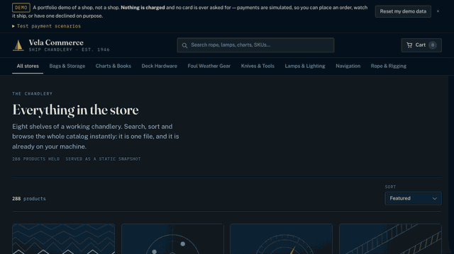

# Vela Commerce

A .NET 10 storefront built around the parts a tutorial e-commerce clone skips: the last unit sold
to exactly one of fifty simultaneous shoppers, a double-clicked checkout that makes one order, and
a payment webhook that can arrive twice without charging twice — each enforced by a PostgreSQL
constraint rather than by C# that merely happens to run first.

[](https://github.com/jdoan5/vela-commerce/actions/workflows/ci.yml)
[](https://github.com/jdoan5/vela-commerce/actions/workflows/codeql.yml)



> The clip is sampled, not real time: the run took about ninety seconds and plays in nine. **It is a recording — nothing is deployed yet. See [Status](#status) below.**

Recorded by driving the running shop, not assembled from mock-ups: catalog, search, a product
page, add to cart, the cart drawer, checkout with a sample address, then order `VELA-PPTNK4G`
moving **Placed → Paid → Packed → Shipped**. The timeline is not an animation. It is
[`OrderTimelineWorker`](src/VelaCommerce.Infrastructure/Fulfilment/OrderTimelineWorker.cs), a
background service moving real rows in real PostgreSQL on a demo clock — 20 seconds to Packed,
40 more to Shipped — and the page stops polling by itself once the order reaches a terminal state,
which is the "no longer checking" the last frames show.

**Status.** Phases 0–4 and 6 of 10 are done — domain, seeded catalog, storefront, cart, tenancy,
checkout, payments, transactional outbox, the order timeline, the Demo Lab and refunds — on **348
passing tests** (191 domain, 8 architecture, 149 integration against a real PostgreSQL 18 in
Testcontainers). Phases 5, 7, 8 and 9 are not started: nightly reset and backups, an admin UI,
preview environments, the ADRs. **There is no hosted demo, deliberately.** The Azure free-trial credit expires
2026-09-04, and upgrading to Pay-As-You-Go permanently removes the spending limit that currently
makes the subscription unable to bill at all — so the app gets finished first and deployed once,
rather than half-deployed onto a subscription that can start charging. The GIF above is what a
clone of this repo does today with `dotnet run`.

---

## Read the interesting parts

If you have ten minutes, read these seven files. Each opens with a comment block stating the rule it
enforces and the plausible implementation that gets it wrong, so you can judge the reasoning
without reading the bodies.

- **[`src/VelaCommerce.Api/Endpoints/CheckoutEndpoints.cs`](src/VelaCommerce.Api/Endpoints/CheckoutEndpoints.cs)**
  — the header comment is the one to read first. Why stock is taken by a conditional `UPDATE`
  whose row count picks the winner and never by loading a `StockItem`; why the double-submit fix
  is to let *both* inserts race a unique index instead of `SELECT`ing first; and why the gateway
  call sits *between* two transactions rather than inside one.
- **[`src/VelaCommerce.Api/Endpoints/WebhookEndpoints.cs`](src/VelaCommerce.Api/Endpoints/WebhookEndpoints.cs)**
  — the only endpoint reachable without a session. Four numbered rules: verify the HMAC over the
  bytes that arrived (never a re-serialization), make exactly-once the database's job, refuse
  out-of-order arrivals by construction, and keep everything before verification off PostgreSQL.
- **[`src/VelaCommerce.Api/Endpoints/RefundEndpoints.cs`](src/VelaCommerce.Api/Endpoints/RefundEndpoints.cs)**
  — giving money back, in the one order that survives a gateway saying no: ask first, record
  second. Read the note on why the order row is locked *across* the gateway call, and why the
  `refunded <= captured` CHECK constraint cannot catch a concurrent over-refund on its own —
  every racing handler writes the same absolute figure, so the column ends up correct above a
  ledger with twelve rows in it. The lock is the only thing load-bearing.
- **[`src/VelaCommerce.Domain/Orders/OrderStateMachine.cs`](src/VelaCommerce.Domain/Orders/OrderStateMachine.cs)**
  — 34 lines, five legal edges, written as a table so a test can assert the whole set. Look for
  the absent self-transitions: `Paid -> Paid` is missing on purpose, which is what turns a
  replayed webhook into a recognised duplicate instead of a second capture.
- **[`src/VelaCommerce.Storefront/Catalog/CatalogService.cs`](src/VelaCommerce.Storefront/Catalog/CatalogService.cs)**
  — the whole shop held in memory. Note what it does *not* have: no `HttpClient` pointed at the
  API, and no method that could grow one. That absence is the architecture.
- **[`src/VelaCommerce.Infrastructure/Persistence/VelaCommerceDbContext.cs`](src/VelaCommerce.Infrastructure/Persistence/VelaCommerceDbContext.cs)**
  — tenancy as a property of the model, not of the query somebody remembered to write. The
  session arrives as an *accessor*, never a value, and a missing accessor means no session, which
  matches no rows. It fails closed.
- **[`tests/VelaCommerce.Integration.Tests/CheckoutStockRaceTests.cs`](tests/VelaCommerce.Integration.Tests/CheckoutStockRaceTests.cs)**
  — fifty shoppers, five units, one instant. Every number asserted exactly: five orders, forty-five
  409s, zero 500s, and a ledger finishing at `reserved = 5` against `on_hand = 5`. "At most five"
  would pass for a shop that sold nothing.

Two more worth the detour:
[`OutboxDispatcher`](src/VelaCommerce.Infrastructure/Messaging/OutboxDispatcher.cs) claims each
message with `SELECT … FOR UPDATE SKIP LOCKED` and transmits the stored bytes unchanged, because
re-serializing a signed payload invalidates its own signature; and
[`ClockRules`](tests/VelaCommerce.Architecture.Tests/ClockRules.cs) walks the compiled IL for reads
of `DateTimeOffset.UtcNow` and friends, with an exemption list that is deliberately empty.

## The rule that shapes everything

> **Nothing on the first-paint path may depend on a resource that sleeps.**

The API and the database are meant to scale to zero, which is what keeps the eventual hosting free
and what makes a cold start otherwise unavoidable. So the first paint is moved off them entirely:
browsing, search, filtering, sorting and paging all run client-side, in the browser, against a
static catalog snapshot fetched once from the app's own origin.

The measured shape of that snapshot, from `src/VelaCommerce.Storefront/wwwroot/catalog.snapshot.json`:

| | |
|---|---|
| Contents | 288 products, 691 variants, 8 categories, no stock |
| Size | 301,727 bytes minified, **42,876 bytes gzipped** |
| Requests to `/api` on a fresh page load | **zero** |
| Generated by | a fixed seed (`20260214`), no clock, no `Guid.NewGuid` — byte-identical between runs, and CI regenerates **both this snapshot and the seed** into a temp directory and fails on any difference |

Stock, cart and checkout genuinely need the API. They are reached lazily, only once a shopper
commits to something, and the UI says "waking the shop up" honestly rather than hiding a cold start
behind a spinner that looks like a slow page. The split is visible in the code: the storefront's
[`CartApiClient`](src/VelaCommerce.Storefront/Cart/CartApiClient.cs) and
[`CheckoutApiClient`](src/VelaCommerce.Storefront/Checkout/CheckoutApiClient.cs) both document that
they are never reached on a first paint, and `CatalogService` never calls the API — it fetches one static file and nothing else.

## The invariants, and where they are actually enforced

Business rules live in the domain, but the two that cost real money are enforced by PostgreSQL as
well, because a rule that only exists in C# is a rule two concurrent processes can both walk past.

**Stock cannot be over-reserved.** `StockItem.TryReserve` states the rule and returns `false`
rather than throwing — but it is an in-memory check on an in-memory copy, so two shoppers holding
two valid instances for the last unit both pass it. Checkout therefore never loads a `StockItem`.
It issues one statement and reads the row count:

```sql
UPDATE stock_items
SET    reserved = reserved + $q
WHERE  variant_id = $v
  AND  deleted_at IS NULL
  AND  on_hand - reserved >= $q
```

One row means this shopper won; zero means they lost, and lost arrives as a 409 that names the SKU,
not a 500. The database carries `CHECK (reserved <= on_hand)` as the backstop if anyone ever writes
the racy version anyway:

```
ERROR:  new row for relation "stock_items" violates check constraint
        "ck_stock_items_reserved_within_on_hand"
```

**A double-submitted checkout creates one order.** Not by `SELECT`ing for the key first — two
simultaneous submits both find nothing and both insert, which is the race, not the fix. Both are
allowed to insert and a unique index on `(demo_session_id, idempotency_key)` picks the winner; the
loser catches the violation, rolls back (which releases its own reservations with it) and returns
the winner's order with a 200.

```
ERROR:  duplicate key value violates unique constraint
        "ux_orders_demo_session_id_idempotency_key"
```

**A settlement applies exactly once.** The insert into `processed_webhook_events` and the order
transition are one transaction, so a duplicate delivery loses on the primary key and takes the
transition down with it. There is deliberately no "have I seen this event?" query. Two copies of one
settlement, released through a single gate at the same instant, produce one `settled` and one
`duplicate` acknowledgement, both 200, and the order captured once — a non-2xx would be retried five
times and abandoned for a delivery that was handled perfectly.

**Order transitions are a table, not a switch.** `OrderStateMachine` holds exactly five legal edges.
Self-transitions are illegal on purpose.

```
Pending -> Paid       Pending -> Cancelled
Paid    -> Packed     Paid    -> Cancelled
Packed  -> Shipped
```

`Pending` is the stored status; the order page labels it **Placed**, which is why the recording
above shows four stages and the table shows `Pending`.

**The cart never silently reprices.** If a price moved between adding an item and checking out, the
cart shows the captured price beside the live one and checkout refuses with a 409 rather than
charging either. A withdrawn variant is refused through the same path.

**Architecture is a test, not a convention.** Eight ArchUnitNET rules run over the compiled IL: the
domain depends on nothing, dependencies point inward, the `DbContext` does not escape persistence,
entities stay sealed and keep the constructor EF needs, and no type reads the ambient clock. That
last rule failed on its first run and was right to — `Order` set `PlacedAt` from
`DateTimeOffset.UtcNow`, which is now a parameter.

**Money is never a float.** Amounts are `long` minor units plus a currency, mapped to `bigint` +
`varchar(3)`. Mixing currencies throws rather than coercing, and `Money.Allocate` splits an amount
across n parts without losing or inventing a cent.

**Payments are simulated, on purpose.** The default gateway is
[an in-repo simulator](src/VelaCommerce.Infrastructure/Payments/SimulatedPaymentGateway.cs), so this
repo clones and completes a purchase with no payment account and no network. It signs its
settlements with HMAC precisely so the webhook receiver has something real to verify, and it offers
six scenarios — succeed, decline, abandon, duplicate, delay, reorder — which is more failure surface
than a live test key would give you.

Five Testcontainers tests in
[`DatabaseInvariantTests`](tests/VelaCommerce.Integration.Tests/DatabaseInvariantTests.cs) prove the
constraints fire by bypassing the domain and writing the illegal row deliberately.

## Running it

Requires the .NET 10 SDK (`global.json` pins 10.0.400) and PostgreSQL 18. Docker is needed only for
the integration tests.

```bash
dotnet build                       # builds the storefront too; the API serves its files
createdb vela_dev
export VELA_DB_CONNECTION="Host=localhost;Port=5432;Database=vela_dev;Username=$USER"
dotnet run --project src/VelaCommerce.Api
```

Then open <http://localhost:5008>. The API migrates and seeds itself on first run in Development,
and serves interactive API documentation at `/scalar`.

The shop and the API share one origin on purpose, which is why `dotnet build` comes first: the demo
session is an `HttpOnly; SameSite=Lax` cookie, a browser will not attach it to a fetch from another
origin, and a storefront on a second port would get a fresh anonymous session and an eternally empty
cart with no error to explain it. So the API host serves the storefront's build output — see
[`StorefrontHostingExtensions`](src/VelaCommerce.Api/Hosting/StorefrontHostingExtensions.cs).

No connection string is committed. It is machine-specific, so it comes from the environment variable
above, or from user-secrets if you prefer it to persist:

```bash
dotnet user-secrets set "ConnectionStrings:Vela" \
  "Host=localhost;Port=5432;Database=vela_dev;Username=$USER" \
  --project src/VelaCommerce.Api
```

Tests, as CI runs them:

```bash
dotnet test tests/VelaCommerce.Domain.Tests
dotnet test tests/VelaCommerce.Architecture.Tests
dotnet test tests/VelaCommerce.Integration.Tests   # needs Docker: Testcontainers starts postgres:18-alpine
```

To regenerate the catalog — both the committed seed file and the client snapshot, which must stay
byte-identical between runs or CI fails:

```bash
dotnet run --project tools/VelaCommerce.SeedGen
```

Part of the HTTP surface has an executable description as a [Bruno collection](api-tests/README.md),
plain-text `.bru` files that CI runs headless against a live API. **Part of it, and worth naming
rather than rounding up:** the collection covers the catalog, the cart and the health probes — six
of the fifteen routes. Checkout, order retrieval, refunds, cancellation, the settlement webhook,
the demo reset and both Demo Lab routes are proved by the integration suite and by the Lab's own
scenarios, not by the collection. Extending it to the money path is the next thing on this repo's
list.

## Phases

Ten phases, tracked in [`docs/PLAN.md`](docs/PLAN.md).

| # | Phase | Status |
|---|---|---|
| 0 | Toolchain, repo, CI | Mostly done — Azure/Terraform/OIDC deployment deliberately deferred |
| 1 | Domain, data, seeded catalog | Done — money in integer minor units, five-edge order state machine, 288 products / 691 variants generated deterministically |
| 2 | The 60-second storefront | Done — Blazor WebAssembly, browsing and search entirely client-side from a static snapshot |
| 3 | Cart, tenancy | Done — demo-session cookie sealed with Data Protection, DbContext-level tenancy filter that fails closed |
| 4 | Checkout, payments, order timeline | Done — payment port and signing simulator, atomic reservation, idempotent checkout, transactional outbox, signed webhook receiver, accelerated timeline |
| 5 | Anti-rot hardening | Not started — nightly reset, backups, uptime monitoring |
| 6 | Demo Lab + refunds | Done — nine lab scenarios with per-scenario permalinks and verdicts; refunds and cancellation with a ledger, a row lock that serialises concurrent refunds, and restock on cancellation |
| 7 | Admin + preview environments | Not started |
| 8 | Make it legible | Not started — measured cold start, ADRs, `/platform` page |
| 9 | Optional differentiators | Not started — pgvector, passkeys, multi-cloud |

Also not built, and not hidden: there is no admin UI, no server-side search beyond the client-side
filtering, and no real payment processor.

## Layout

```
src/VelaCommerce.Domain           Aggregates and invariants. No dependencies.
src/VelaCommerce.Infrastructure   EF Core mapping, migrations, seeding, outbox, payments, workers.
src/VelaCommerce.Api              Minimal API host; also serves the storefront in one origin.
src/VelaCommerce.Storefront       Blazor WebAssembly shop and its catalog snapshot.
tests/                            Domain, architecture and Testcontainers integration tests.
tools/VelaCommerce.SeedGen        Deterministic catalog generator.
api-tests/                        Bruno collection, run headless in CI.
docs/PLAN.md                      The full build plan, 10 phases.
```

(`Pending` is the stored status; the order page labels it *Placed*.)


## Licence

MIT. Catalog imagery is generated client-side rather than committed; see the attribution manifest in
`seed/catalog.seed.json`.
