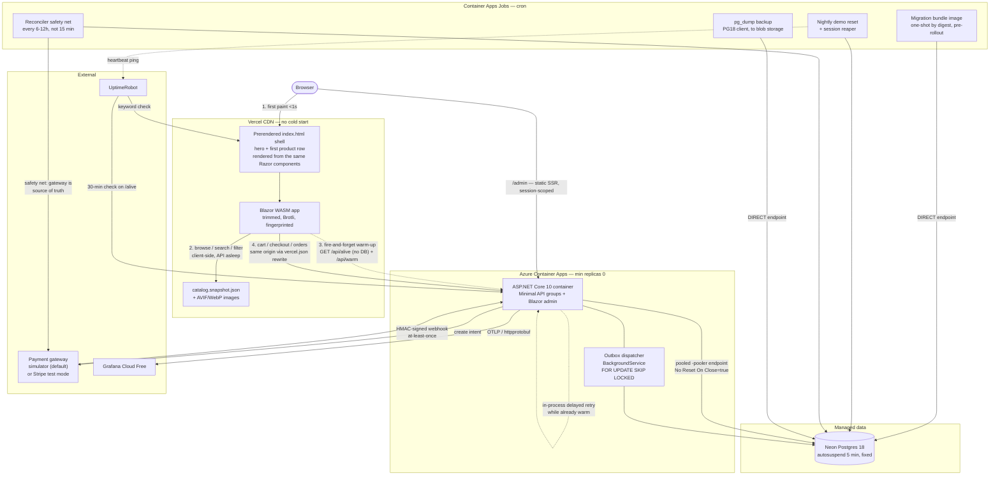
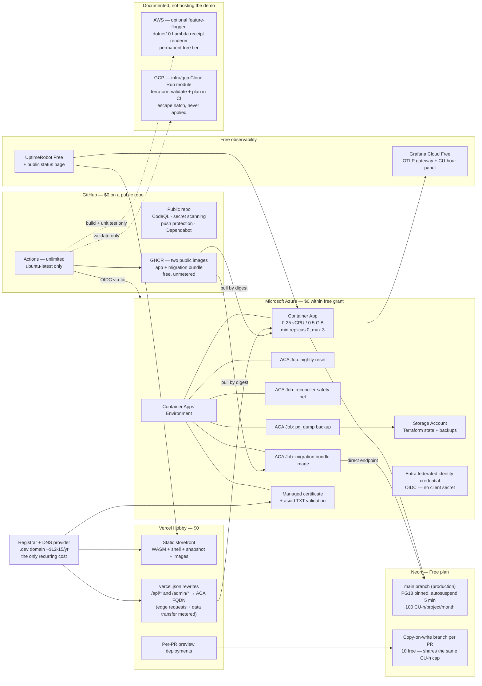

# .NET 10 E-commerce Portfolio Showcase — "Vela Commerce"

**Target directory:** `/Users/jdoan/Documents/GitHub/dotnet/vela-commerce` (the plan was written against `Project 1/E-commerce Web App/`; the repository was renamed before the first commit)
**Written:** 2026-09-02 · Solo dev, part-time, new to .NET · Must stay live cheaply for years

> **Machine-state note (verified on disk 2026-09-02, correcting the original brief).** Two premises in the original brief are false and this plan is written against the machine's actual state:
> 1. **The .NET SDK is already installed.** `~/.dotnet/dotnet --info` reports SDK **10.0.400**, RID `osx-arm64`, runtimes `Microsoft.NETCore.App` / `Microsoft.AspNetCore.App` **10.0.11**, installed via `dotnet-install.sh`. `~/.zshrc` lines 11–13 already export `DOTNET_ROOT=$HOME/.dotnet` and put `$DOTNET_ROOT` and `$DOTNET_ROOT/tools` on PATH. **Do not `brew install --cask dotnet-sdk`** — that installs a second 10.0.400 at `/usr/local/share/dotnet` while `DOTNET_ROOT` still points at `~/.dotnet`, the classic dual-root failure.
> 2. **The target directory is not empty and is already a git repo.** It holds one commit (`b370e30` "Scaffold VelaCommerce solution on .NET 10"), **`VelaCommerce.slnx`** (the XML solution format, not `.sln`), a `global.json` pinning `10.0.400` with `rollForward: latestFeature`, a 484-line `.gitignore`, an 18 KB `.editorconfig`, and five projects: `VelaCommerce.Api`, `VelaCommerce.Domain`, `VelaCommerce.Infrastructure`, `VelaCommerce.Domain.Tests`, `VelaCommerce.Integration.Tests` (the two test projects on **xUnit v2** — `xunit 2.9.3` + `xunit.runner.visualstudio 3.1.4` + `Microsoft.NET.Test.Sdk 17.14.1` + `coverlet.collector 6.0.4`).
>
> Everything below uses the **`VelaCommerce.*`** prefix to match what is committed. Three further verified facts shape §11: `dotnet new xunit3` and `dotnet new aspire-apphost` **do not exist** on SDK 10.0.400 (both need template packs installed first, and `aspire-apphost` is not even a current Aspire short name), the `aspire` CLI is **not installed** (`~/.dotnet/tools` does not exist and `dotnet tool list --global` is empty), and `dotnet new packagesprops` followed by `dotnet build` **fails NU1008** against the ten inline-versioned `PackageReference` items already committed.

---

## 1. The pitch

Build **Vela Commerce**, a working storefront on .NET 10 LTS where a reviewer can browse a few hundred products, add to cart, pay with a prefilled test card, and watch an order advance Pending → Paid → Packed → Shipped on a demo-accelerated clock — then open a **Demo Lab** page and personally trigger the three failures every e-commerce interview eventually reaches: two tabs racing for the last unit in stock, a double-submitted checkout, and a duplicated payment webhook. The story it tells about the developer is not "I can model a Product" — it is "I decided where the cold start goes, I enforced invariants in the database rather than in hopeful `if` statements, and I wrote down the decisions that went against the more impressive-sounding option."

The architectural signature is an inversion: **nothing on the first-paint path may depend on a scale-to-zero resource**, so browse, search and filter run client-side against a build-time catalog snapshot served from a CDN and work perfectly while the API and the database are both asleep. In the first 60 seconds a reviewer sees a finished-looking store in under a second (no spinner, no white screen), a banner handing them a test card and a "Reset my data" button, and a README whose first screen is a live link, a **CI-committed looping GIF** of the happy path, and a "click these five things" list.

Behind it: one container on Azure Container Apps inside an ongoing free grant, Neon Postgres 18, all infrastructure in Terraform, every deploy over GitHub OIDC with zero stored cloud secrets, and a total steady-state cost of about a dollar a month with no expiry cliff. It is built so the link still works in 2029 — and the README explains, with arithmetic, exactly how.

---

## 2. Recommended stack

| Area | Choice | Why | Alternatives considered |
|---|---|---|---|
| **Runtime / SDK** | .NET 10 (`net10.0`), SDK **10.0.400** — **already installed at `~/.dotnet`**, pinned by the committed `global.json` (change `rollForward` from `latestFeature` to `latestPatch`) | Only current LTS (supported to 2028-11-14). .NET 9 and 8 both leave support 2026-11-10 — starting on either dates the project before the first commit. `latestPatch` is the stricter, more defensible pin for a repo claiming reproducibility | .NET 9/8 (expiring); .NET 11 preview (STS, no RC yet, GA anticipated 2026-11-10); a second Homebrew SDK install (rejected — dual-root conflict with `DOTNET_ROOT=$HOME/.dotnet`) |
| **Language** | C# 14 (ships with .NET 10) | Extension members, `field` keyword, null-conditional assignment — current-looking without being clever | C# 15 (preview only, requires .NET 11 preview SDK) |
| **Backend host** | One ASP.NET Core 10 container: Minimal API + admin UI | One cold start, one image, one deploy, one bill. A modular monolith is the honest answer at this size | Microservices (rejected — no scaling axis, multiplies cold starts against a fixed free grant); separate API and admin hosts |
| **API style** | Minimal APIs in `MapGroup` endpoint groups, `TypedResults`, RFC 9457 ProblemDetails, .NET 10 `AddValidation()` + `[ValidatableType]` | Microsoft's current recommendation for new projects; fewer MVC types = smaller DI graph = directly a cold-start win | MVC controllers (docs recommend only for `IModelBinder`/`IModelValidator`/application parts/OData — none needed); FastEndpoints |
| **API docs** | `Microsoft.AspNetCore.OpenApi` → OpenAPI 3.1, generated at build time via `Microsoft.Extensions.ApiDescription.Server`, `openapi.json` committed; **Scalar.AspNetCore 2.17.2** (already referenced in `VelaCommerce.Api`) at `/scalar` in Development only | Built-in generator, no Swashbuckle. Committed spec lets CI prove code, docs and the Bruno collection cannot drift. Microsoft's guidance is Development-only UI | Swashbuckle + Swagger UI; no committed spec |
| **Storefront UI** | Standalone **Blazor WebAssembly** (`net10.0`), published to static files, with a build-time prerendered `index.html` shell (rendered from the **same Razor components** via `Microsoft.AspNetCore.Components.Web.HtmlRenderer` in `SeedGen`) + committed `catalog.snapshot.json` | The only Blazor hosting model that publishes to pure static files, so it lives on a CDN with **zero cold start**. Rendering the shell from the real components (not a hand-written duplicate) is what keeps shell and hydrated output from diverging | Blazor Web App with Interactive Server (needs a live SignalR circuit — cannot run on Vercel, fragile on min-replicas-0); Blazor Auto; React/Next; hand-written skeleton shell (fallback — but it removes product content from first paint and changes the "<1s finished-looking store" claim) |
| **Admin UI** | Blazor Web App inside the API host — **static SSR only** for MVP/v1; Interactive Server for the live order feed is a v1-optional upgrade. **Demo-session-scoped** (see §3 admin trust model) | Behind a login, so its cold start never touches the first 60 seconds. Static SSR removes SignalR-on-scale-to-zero from the critical plan | Full Interactive Server admin (deferred — see §10 risk on circuits); separate admin SPA |
| **Charts** | Hand-rolled Razor components emitting inline SVG | No CDN dependency, no JS interop latency, themeable light/dark, keeps the payload small | Chart.js/ApexCharts via interop |
| **Database** | **PostgreSQL 18** everywhere — Postgres.app 18 locally for ad-hoc/Rider/`pg_dump`, `postgres:18` container under Aspire + Testcontainers, **Neon Free** in production with `pg_version = 18` **pinned explicitly in Terraform**. UUIDv7 generated **in .NET** via `Guid.CreateVersion7()`, never depending on server-side `uuidv7()` | Same Postgres **major version** across dev/test/prod removes an entire bug class. Neon has defaulted new projects to PG 18 since 2026-06-05 (GA on Neon 2026-05-01) and currently runs 18.6; Free imposes storage/compute/branch/egress limits but **no major-version restriction**. Generating UUIDv7 client-side means PG18 features are an optimisation, not a dependency | Supabase Free (pauses projects after 1 week idle — disqualifying); Azure Flexible Server (12-month allowance at best, unconfirmed); Cloud SQL (no free tier); RDS (new-account plan ends in account closure) |
| **ORM / provider** | **EF Core 10.0.x** + **Npgsql.EntityFrameworkCore.PostgreSQL 10.0.3** (already referenced in `VelaCommerce.Infrastructure`), provider configured to target PG 18 | Current LTS data pairing (provider requires EF Core ≥10.0.4 <11.0.0). Translates `Guid.CreateVersion7()` to PG18 `uuidv7()` where available, supports jsonb complex types, named query filters, `ExecuteUpdateAsync` | Dapper (loses migrations + query filters); raw ADO.NET |
| **Migrations** | `dotnet ef migrations bundle --self-contained --target-runtime linux-x64`, packaged as a **second, minimal GHCR image** tagged with the same commit SHA, run as a **one-shot Container Apps job by digest** against Neon's **direct** endpoint before the app revision rolls out. Committed `migrations script --idempotent` SQL beside each migration | EF Core's own documented deployment path. Startup migrations need elevated schema permissions, offer no rollback, and would add seconds to the cold start this whole design protects. The committed SQL makes schema changes reviewable in the PR diff (a bundle cannot show you its SQL) | `Database.MigrateAsync()` at startup (rejected); `dotnet ef database update` in CI (local-dev-only per docs); shipping the SDK in the app image (rejected per EF guidance) |
| **Auth** | No signup wall: anonymous signed `__Host-` demo-session cookie for shoppers. ASP.NET Core Identity cookie auth for admin, with a one-click "Sign in as demo admin" that grants a **session-scoped** admin role. Passkey/WebAuthn registration as a stretch | A login form is the fastest way to lose a reviewer in the first 60 seconds. Passkeys are a .NET 10 Blazor Identity template feature worth showing on the account that actually needs security | Identity everywhere from MVP (friction); Entra External ID (a reviewer should not need an IdP account to look at your work); global demo admin (rejected — breaks the tenancy guarantee) |
| **Payments** | `IPaymentGateway` port with **the in-repo HMAC-signed simulator as the default**, and Stripe test mode behind a feature flag | The simulator exercises identical signature-verification, idempotency and out-of-order code with **no third-party account that can rot in year three** — and it can be told to duplicate, delay or reorder events. Stripe-first would put the only live external dependency on the demo's critical path | Stripe hosted redirect (2–4s of the 60 you have, leaves your domain); Stripe-only (rot risk); PayPal |
| **Background jobs** | Transactional **outbox** drained by an in-process `BackgroundService` using `FOR UPDATE SKIP LOCKED`. Payment reconciliation is **event-driven while the container is already warm** (in-process delayed retry + lazy reconciliation on any read of a pending order), with a **6–12-hourly** safety-net Container Apps Job. Nightly reset and session reaper as Container Apps Jobs | Costs nothing extra, survives the container scaling to zero mid-order, and is correct already if replicas ever go above one. Platform cron, not GitHub cron (see §10). The low job cadence is a **Neon CU-hour budget decision**, not an accident — see §9 | Hangfire/Quartz (needs min replicas ≥1 — alone burns ~3.6× the free grant); Azure Functions; GitHub `schedule:`; **a 15-minute reconciler poll (rejected — see §9 arithmetic: ~61–75 of 100 free CU-hours/month before a single visitor)** |
| **Caching** | `HybridCache` in-memory L1 only, immutable CDN caching + ETags on the snapshot and images. **ASP.NET Core output caching is used only for repeat requests inside one warm window and is described as exactly that** | A Redis instance is the single easiest way to turn a $0/month demo into a ~$16/month one, and a single scale-to-zero replica has nothing to distribute to. In-process output cache is discarded at every scale-down, so it warms at most one visitor's session — the CDN/ETag layer is what actually carries the load. ADR names the trigger to add L2: more than one replica. *Verify current `Microsoft.Extensions.Caching.Hybrid` version at install time* | Redis/Azure Cache (rejected on cost); no caching |
| **Search** | Client-side instant filter over the committed snapshot for the demo path; **Postgres tsvector + GIN** (with `pg_trgm` typo tolerance) server-side, the tsvector column **stored-generated** so it works on PG16+ as well as 18. Stretch: **pgvector 0.8.0** with embeddings precomputed at seed time | Search must feel instant on first paint, which means it cannot depend on a sleeping API. Precomputed embeddings mean the live demo never calls a paid embedding API at runtime. The catalog is sized in the hundreds (see §5) so facets and FTS are legible rather than decorative | Elasticsearch/Meilisearch (always-on container, permanent monthly cost); Algolia |
| **Observability** | OpenTelemetry via Aspire ServiceDefaults (`OpenTelemetry.Exporter.OpenTelemetryProtocol` **1.18.0**, `Instrumentation.AspNetCore` **1.18.0**) → OTLP/httpprotobuf → **Grafana Cloud Free** OTLP gateway. Includes a **Neon CU-hour consumption panel** | No collector to host. 10k active series / 50 GB logs / 50 GB traces / 14-day retention, no expiry. Switching backends is an env-var change, not a code change. The CU-hour panel makes the free-tier budget observable rather than assumed | Application Insights (the widely-repeated "5 GB/month free" is **not** in Microsoft's current Azure Monitor Logs cost docs — a metered workspace is a slow leak on a years-long demo); self-hosted Prometheus/Grafana |
| **Testing** | **xunit.v3 4.0.0** on Microsoft Testing Platform — **requires `dotnet new install xunit.v3.templates` first (short names `xunit3`, `xunit3-extension`), and MTP is opt-in via `<UseMicrosoftTestingPlatformRunner>`, not the default runner**. The two committed xUnit **v2** test projects are migrated as a budgeted task. **Testcontainers.PostgreSql 4.14.0** (`postgres:18`) via `WebApplicationFactory`; **TngTech.ArchUnitNET 0.13.4**; **Microsoft.Playwright 1.62.0**; **dotnet-stryker 4.16.0** nightly → free Stryker Dashboard; **coverlet.collector 6.0.4 → Cobertura → ReportGenerator → committed badge**; one committed k6 script | Every version current — a reviewer reads your `.csproj`. Specifically **not** `NetArchTest.Rules`, whose last stable release was 2021-05-23. Coverage is wired end to end rather than badged and hoped for | NetArchTest.Rules (dead package); NUnit/MSTest; NBomber (*verify licence before putting it in a public repo*); Codecov/Coveralls (extra account to rot) |
| **API tooling** | **Bruno** desktop (upgrade 4.0.0 → **4.1.0**) + **@usebruno/cli 4.1.0**, collection committed as `.bru` under `api-tests/`, run **from the collection root with `-r`** by `usebruno/bruno-cli-action v1.0.0` with `--reporter-junit` | Plain-text requests live in the repo, so API changes and collection changes appear in the same PR diff — something a Postman cloud workspace behind a sign-in can never show | Postman (cloud workspace, invisible to a repo reader); Rider HTTP client (scratch only); curl scripts |
| **Container build** | `dotnet publish --os linux --arch x64 /t:PublishContainer`, `ContainerFamily=noble-chiseled-extra`, `PublishReadyToRun=true`, `PublishRepositoryUrl=true` + SourceLink — **no Dockerfile** in the production path. **Two images**: the app and the migration bundle | Builds and pushes images **with no Docker daemon at all**, cross-publishes amd64 from Apple Silicon with no buildx/QEMU. `-extra` keeps ICU + tzdata — plain chiseled/alpine/distroless require `InvariantGlobalization=true`, which silently breaks currency formatting | Hand-written Dockerfile + buildx; `alpine`/`noble-chiseled` (ICU trap); `resolute-chiseled` (26.04 — newer, less battle-tested) |
| **IaC** | **Terraform 1.16.0** (already installed), plain HCL, reusable modules under `infra/modules/` consumed by **two thin roots** (`envs/production`, `envs/preview`) differing only by a tfvars file. Includes `dns` and `custom-domain` modules | Two environments from one module set proves the abstraction actually holds rather than shipping copy-paste HCL in module-shaped folders. Plain HCL keeps OpenTofu a one-line swap; BUSL has no bearing on a portfolio repo (ADR) | OpenTofu (*current version unconfirmed — sources disagree between 1.11.6 and 1.12.2*); Bicep (Azure-only); Pulumi; click-ops |
| **CI/CD** | **GitHub Actions**, public repo, `ubuntu-latest` standard runners only, every action pinned by full commit SHA, OIDC-only cloud auth | Free and unlimited on public repos with standard runners; unlocks free CodeQL, secret scanning, push protection, dependency review and Dependabot. Larger and macOS runners are billed even on public repos, and macOS runners have no Docker daemon for Testcontainers | Azure DevOps; larger runners; self-hosted |
| **Hosting — storefront** | **Vercel Hobby**, static WASM output + prerendered shell + images, custom domain, `vercel.json` rewrites for `/api/*` and `/admin/*` | CDN static has no cold start. Single origin kills the CORS preflight round trip on the first API call and gives genuine first-party `__Host-` cookies | **Cloudflare Pages** and **Azure Static Web Apps** (both can proxy — genuine drop-in fallbacks); **GitHub Pages cannot proxy**, so on that fallback the same-origin cookie and no-preflight design collapse and the CORS fallback design in §10 applies |
| **Hosting — API + admin** | **Azure Container Apps**, Consumption, 0.25 vCPU / 0.5 GiB, **min replicas 0**, max 3 | **One of two** permanently-free-at-this-scale options; chosen over Cloud Run on **career fit and solo maintenance surface, not on cost** (the free tiers are numerically identical). 180,000 vCPU-s + 360,000 GiB-s + 2M requests per subscription **per calendar month with no documented expiry** — an ongoing grant, not a trial credit — and the vCPU-s/GiB-s half is a single pool that **Container Apps Jobs draw from too** | Cloud Run (numerically identical free tier, better reported .NET cold start — loses on career fit only); App Runner (no free tier, ~$123/yr idle); Fargate (no free tier); App Service F1 (60 CPU-min/day, no TLS, no custom domain, production unsupported) |
| **Hosting — database** | **Neon Free**: PG18 (pinned), 0.5 GB/project, **100 CU-hours per project per month**, 5-min autosuspend (fixed, cannot be disabled or lengthened), 10 branches, 5 GB egress | The only candidate that survives unattended for years — autosuspend is automatic and reversible and never deletes data. The CU-hour cap is a hard design constraint, not a footnote: see §9 | Supabase Free (pauses after 1 week idle, manual restore); Azure/GCP/AWS managed Postgres (no permanent free tier on any of the three); Neon Launch (~$0.106/CU-hour — the documented upgrade if the cap ever binds) |
| **Registry** | **GitHub Container Registry**, public images (app **and** migration bundle), tagged `sha-<commit>`, **deployed by digest** | Free and unmetered for public images; the repo is public anyway. Digest deploys make "which build is live?" answerable and immune to a retag | ACR Basic (~$0.167/day ≈ $5/mo, *secondary-sourced*) — kept as the documented escape hatch if measurement shows registry distance is a material share of cold start |
| **Uptime** | **UptimeRobot Free**: keyword monitor on the static storefront (primary signal), **30-minute** HTTP check on `/alive`, heartbeat monitor pinged by the nightly reset | 50 monitors + public status page at $0, commercial use permitted since 2026-06-15. The 30-minute interval is deliberate — a 5-minute check against a ~5-minute idle window silently pins the container warm and eats the free grant. `/alive` does **not** touch the database | Better Stack (*free-tier numbers unverified*); Azure Monitor alerts (metered) |

---

## 3. Architecture

### System components and data flow

> Mermaid note: every subgraph and its nodes are declared before any edge that references them, and all cross-subgraph edges appear at the bottom. Mermaid binds a node to the context where it is *first encountered*, so a forward reference silently pulls a node out of its intended subgraph. Render both diagrams on GitHub before committing the exported SVGs.



### Hosting topology



### Internal design

- **Modular monolith, one deployable.** `VelaCommerce.Domain` (aggregates, value objects, zero dependencies) → `VelaCommerce.Application` (use-case handlers, ports) → `VelaCommerce.Infrastructure` (EF Core, Npgsql, gateway adapters, outbox) → `VelaCommerce.Api` (composition root, endpoint groups, admin). `VelaCommerce.Shared` holds DTO contracts referenced by both storefront and API so request/response shapes cannot drift. ArchUnitNET enforces the arrows: Domain depends on nothing, no EF Core type escapes Infrastructure, endpoint classes are `internal sealed`, no `DateTime.Now` (only `TimeProvider`, which also makes reservation-expiry tests deterministic), and **no PgBouncer-incompatible constructs anywhere** (see the pooler risk in §10).
- **Vertical slices inside modules.** Catalog, Inventory, Cart, Ordering, Payments — each a folder with its endpoints, handlers and EF configuration together. One `DbContext`, one migrations history. Per-module DbContexts were considered and rejected: for a first EF Core project they multiply migration pain without buying anything a reviewer can see.
- **Stock reservation as one atomic conditional UPDATE.** `UPDATE stock SET reserved = reserved + @qty WHERE variant_id = @id AND on_hand - reserved >= @qty` — zero rows affected means insufficient stock and returns a 409 ProblemDetails with `type` `.../out-of-stock`. No SELECT-then-UPDATE race, no pessimistic lock, no retry loop, one sentence to explain in an interview. A CHECK constraint (`reserved >= 0 AND on_hand - reserved >= 0`) is the belt to that braces, and `xmin` optimistic concurrency is used only on the Order aggregate where it genuinely helps.
- **Reservations expire two ways, deliberately.** A 15-minute TTL (90 seconds in demo mode so a reviewer can watch it) released eagerly by the outbox worker *and* evaluated lazily on every stock read, so availability is always `OnHand − active reservations`. Correctness never depends on the scheduler running; a stalled job degrades to "released slightly late", never to overselling.
- **Aggregates own their invariants, and the invariants have real inputs.** `Money` (decimal + ISO-4217, arithmetic across currencies throws) as an EF complex type; a `ShippingAddress` value object with a region; a deliberately simple, **explicitly documented flat-rate shipping table by region and a flat tax rate per region**, so the DB CHECK asserting `total = subtotal + shipping + tax − discount` has four live terms rather than two constants; `Order` with immutable line snapshots (product name, SKU, unit price at purchase) so a later repricing cannot rewrite history; a closed-set `OrderStatus` state machine (including a **Cancelled** edge) whose illegal edges throw and are covered by a parameterised theory over every from/to pair.
- **Orders survive cookie loss.** Anonymous checkout still issues a human-readable order number and a **signed retrieval link** on the confirmation page (and in the Demo Lab), so clearing the demo cookie does not orphan the order a reviewer just placed.
- **Idempotent checkout enforced by a unique index, not application logic.** `POST /api/checkout` requires an `Idempotency-Key`. `checkout_attempts` has a unique index on `(demo_session_id, idempotency_key)` storing the resulting order id and the serialized response; replay returns the original response and never creates a second payment intent, and a different request body under the same key returns 409 with the mismatch explained.
- **Exactly-once webhooks from at-least-once delivery.** `processed_webhook_events` keyed on the provider event id; the handler verifies the HMAC signature with a constant-time comparison over the raw body, then inserts the event id **and** applies the order transition **in one transaction**. A duplicate hits the unique constraint, is swallowed, returns 200 so the provider stops retrying. Out-of-order events are resolved by the state machine refusing backwards edges, not by arrival order.
- **Reconciliation is event-driven first, scheduled last.** Webhooks arrive precisely when the API has scaled to zero, so an order entering `AwaitingPayment` queues an **in-process delayed retry** (cheap — the container is already warm and the DB connection already open) and any read of a pending order reconciles **lazily**. A safety-net Container Apps Job runs only every 6–12 hours. This is a budget decision as much as a design one: a 15-minute poll against Neon's fixed 5-minute autosuspend consumes ~61–75 of the 100 free CU-hours a month before a single visitor arrives (§9). The UI shows an honest "confirming payment" state rather than a spinner that lies.
- **Transactional outbox.** Domain events append to `outbox_messages` in the same `SaveChangesAsync` as the aggregate change, so a state change without its side effect (or vice versa) is structurally impossible. In demo mode the outbox is also what advances the accelerated order timeline.
- **Per-visitor demo tenancy is a first-class design element, and admin is inside it.** Every mutable row carries a `DemoSessionId` applied by an EF Core **named global query filter** bound to the signed cookie — isolation is a property of the `DbContext`, not something each query must remember. Two reviewers never collide; "Reset my data" is scoped and sub-300ms; the nightly job reaps sessions older than 24 hours.
- **The admin trust model, stated explicitly.** The one-click demo admin is **demo-session-scoped, not global**: it sees and mutates only the caller's own orders, and price/stock changes write to a **per-session overlay** over an immutable shared seed catalog. Bulk repricing via `ExecuteUpdateAsync` — the one operation that *looks* global by design — writes overlay rows and is the specific case an integration test targets. Genuinely global mutations require a credential that is not published. Tests assert that an admin action in session A is invisible in session B, and that the seed catalog rows are never updated.
- **Cold start is a tracked metric with an engineering budget.** Image under 240 MB, **measured 2026-09-05 at 206 MB** on a native x64 runner (`noble-chiseled-extra` + ReadyToRun; 157 MB of that is the runtime and ICU, 22 MB the Blazor shop — see [`docs/measurements/cold-start.md`](measurements/cold-start.md)), no migrations at startup, no API-docs UI in Production, a deliberately small DI graph, Kestrel binding the port before expensive initialization so ACA does not kill a slow starter, client retry with backoff, and an honest "waking the demo up" skeleton. Measured **locally first** by running the published image under Docker Desktop, then continuously by the 30-minute uptime check.

### Deliberately not done

- **No microservices.** There is no scaling axis here that justifies splitting, and each extra service multiplies cold starts against a fixed monthly grant. The seams (ports, outbox, ArchUnit rules) are drawn where a real split would happen later. Claiming microservices on a solo part-time project reads as inexperience, not seniority — the ADR says so.
- **No Redis, no Elasticsearch, no blob storage beyond Terraform state and backups, no ACR, no NAT gateway.** Each is a $5–20/month line item that buys this demo nothing. A single scale-to-zero replica has nothing to distribute a cache to; product images are committed and CDN-served. The ADR names the trigger for L2 cache: more than one replica.
- **No standing staging environment.** Per-PR Neon copy-on-write branches plus a labelled ACA revision at 0% traffic give real pre-merge isolation at $0 — with the caveat, stated in the ADR, that branch computes draw from the same 100 CU-hour project cap. A solo part-time developer maintaining a staging tier is maintaining a second thing that can rot.
- **No MediatR, no repository-over-`DbContext`, no AutoMapper.** Handlers are plain classes injected into endpoints; `DbContext` *is* the unit of work; DTOs are mapped by hand in the slice that owns them. Ceremony that a reviewer has to read past is a cost, not a signal.
- **Returns/RMA, multi-warehouse, backorder and deep product taxonomy are out of scope**, and an ADR says so, so their absence reads as a decision rather than an oversight. Cancellation, refunds, a shipping address and a flat tax/shipping strategy are **in** scope precisely because they are what give the order-total invariant real inputs.
- **The API is not deployed to all three clouds.** Cloud Run's free tier is numerically identical to Container Apps' (180,000 vCPU-s, 360,000 GiB-s, 2M requests/month), so a third deployment buys **zero** capability — and zero availability, because every copy would still depend on the same single Neon project. The "multi-cloud" app would have exactly one point of failure. What it *would* buy is three IaC roots, three OIDC trusts, three observability wirings and three things that rot independently, on ten hours a week. This is ADR-002, linked from the README's first screen, with a named revisit trigger.

---

## 4. How each tool is used

| Tool | Concrete usage |
|---|---|
| **JetBrains Rider 2026.2** | Primary IDE for all C#/Razor. **Point it at the existing `~/.dotnet` SDK** (Settings → Build, Execution, Deployment → Toolset and Build → .NET SDK) — Rider does not read `~/.zshrc`, and Rider does not bundle an SDK. A committed **`.idea` run-configuration set** (Aspire AppHost, `dotnet ef` migration commands, the Playwright suite, `bru run`) is a small, visible artifact a cloning reviewer gets for free. Its **database tool window** is the day-to-day Postgres client for both Postgres.app 18 and Neon. **Rider's bundled dotCover** produces the local coverage number; CI produces the badged one. The pre-configured AWS Toolkit (`.idea`, profile `default`, region `us-east-1`) is used only for the optional Lambda; Rider's HTTP client is scratch-only because Bruno owns the committed collection. |
| **Vercel** (CLI 54.14.2, **not logged in**) | **Used.** Hosts the static storefront (WASM + prerendered shell + `catalog.snapshot.json` + images) on the custom domain, plus `vercel.json` rewrites putting `/api/*` and `/admin/*` on the same origin (kills the CORS preflight on the first API call, gives real first-party `__Host-` cookies, hides the Azure hostname). **This puts Vercel on the critical path for every API call** and consumes Edge Requests and Fast Data Transfer — budgeted as its own line in §9, not hand-waved as "effectively zero function usage". Per-PR preview deployments. **Deliberately NOT hosting the .NET app**: Vercel has no .NET runtime, but it *does* run arbitrary OCI containers from a `Dockerfile.vercel` — a working spike lives on a branch with an ADR. Rejected as primary because instances scale down after 5 minutes idle so nearly every visit pays a full .NET cold start with no prewarm hook, containers are stateless with no static IP, and Hobby is non-commercial-only. |
| **Azure** (CLI 2.89.1, logged in) | **The primary cloud.** Container Apps environment + app (min replicas 0) runs the API and admin; four Container Apps Jobs run the nightly reset/reaper, the reconciler safety net, the one-shot migration bundle and the `pg_dump` backup; a managed certificate + `asuid` TXT validation bind the custom domain; a Storage Account holds Terraform `azurerm` state **and the backups**; an Entra federated identity credential gives GitHub Actions keyless OIDC deploys. `az containerapp secret set` in the deploy step is what keeps connection strings, the webhook signing key and the Grafana token **out of Terraform state** — that is the mechanism behind the security claim in §10, not a stray CLI call. Explicitly not used: ACR (GHCR is free), App Service F1 (unusable), Azure Database for PostgreSQL (no permanent free tier), Application Insights (metered — and the "5 GB free" figure is not in Microsoft's current cost docs). |
| **AWS** (CLI 2.36.33, logged in) | **Not used to host anything the demo depends on.** One optional, **feature-flagged** Native AOT `dotnet10` Lambda (receipt renderer, `provided.al2023`, us-east-1 to match the Rider toolkit profile) with its own Terraform module and OIDC role, **built and unit-tested in CI but deployed on demand**, degrading silently to server-rendered HTML receipts. **Day-one action: check the account's creation date and plan type, then write the ADR against what is true for *this* account.** The post-2025-07-15 Free plan — which lasts up to six months after which AWS closes the account with a 90-day data grace — applies to **new** accounts, and existing customers are ineligible for it; this CLI is already authenticated, so the account may well predate the change and carry no closure risk at all. Set a $1 budget alert regardless. App Runner has no free tier and cannot truly scale to zero (~$10.22/mo idle memory at 1 vCPU/2 GB ≈ $123/yr); Fargate has no free tier. Lambda's 1M requests + 400,000 GB-s/month is the one permanent AWS free tier, and `dotnet10` on AL2023 is supported to 2028-11-14. |
| **GCP** (gcloud 581.0.0, logged in) | **Not used at runtime, and the login is decorative — say so.** `infra/gcp/` holds a Cloud Run module deploying the identical GHCR image, kept honest by `terraform validate` and `terraform plan` in CI and documented as the one-command escape hatch with a named trigger (if Azure changes the Container Apps grant). Reason it loses: career fit and solo maintenance surface, not technology — Cloud Run's free tier is identical and its .NET cold-start behaviour is reportedly the best of the three. Deploying a prebuilt image also sidesteps the unverified question of whether `gcloud run deploy --source` buildpacks currently support .NET 10. |
| **Bruno** (desktop 4.0.0 → **4.1.0**; `bru` CLI was not installed when this was written — it is now, at 4.1.0) | **Used.** Full API collection committed as plain-text `.bru` under `api-tests/` with `local`/`preview`/`ci` environments holding only placeholders and `{{variables}}`; `.env` gitignored. `npm i -g @usebruno/cli` (Node 24.17.0 is fine). **Always invoked from the collection root with `-r`** (`cd api-tests && bru run -r --env local`) — `bru` resolves `bruno.json` from the working directory and does not recurse without `-r`. Run by `usebruno/bruno-cli-action v1.0.0` with `--reporter-junit` as the post-deploy smoke test against preview and production; secrets injected via `bru run -r --env ci --env-var token=$TOKEN`. A CI step diffs the collection's endpoint list against the committed `openapi.json` — "my docs cannot drift" rather than "I wrote docs". The **desktop app** is the reviewer-facing half: the RUNBOOK tells a cloner to open the same folder (File → Open Collection) and use the GUI's environment switcher to hit local, preview or production without touching a CLI. |
| **PostgreSQL 18** | **Used in four places**, same major version everywhere: Postgres.app 18 for ad-hoc/Rider work **and as the `pg_dump` client** (its binaries at `/Applications/Postgres.app/Contents/Versions/18/bin` are the only PG18 client on this Mac, and are also the fallback database when the Docker daemon is down), a pinned `postgres:18` container under the Aspire AppHost, `postgres:18` in Testcontainers, Neon (18.6, **pinned via `pg_version = 18` in Terraform**) in production. Used as more than a table store: uuidv7 keys generated in .NET via `Guid.CreateVersion7()`, jsonb complex types for product attributes, named query filters for soft-delete **and demo-session tenancy**, `ExecuteUpdateAsync` for the overlay repricing and expiry sweeps, CHECK constraints backing domain invariants, **unique indexes doing the idempotency and webhook-dedupe work**, stored-generated `tsvector` + GIN + `pg_trgm` search, `xmin` on Order, pgvector 0.8.0 as a stretch. Two connection strings: pooled `-pooler` for the app with `No Reset On Close=true`, direct for migrations and `pg_dump`. |
| **Docker Desktop 29.7.2** (installed, **daemon NOT running**) | **Used for local development and for the first cold-start measurement.** The Aspire AppHost's `postgres:18` container and Testcontainers integration tests both hard-require the daemon; so does **running the published production image locally to measure cold start before paying for a cloud measurement** — which is the one thing Docker is uniquely good at here. **Not used to build images**: `dotnet publish /t:PublishContainer` produces and pushes OCI images with no daemon at all, and `-p ContainerArchiveOutputPath=./artifacts/api.tar.gz` writes a tarball when it is down. The only Dockerfile in the repo is `Dockerfile.vercel` on the preview/spike branch. `make test` preflights the daemon and fails with "Start Docker Desktop" rather than a 90-second timeout. CI uses `ubuntu-latest` (Docker present); macOS runners have none and are billed even on public repos. |
| **Terraform 1.16.0** | **Used for everything.** `infra/modules/{aca-app, aca-job, dns, custom-domain, neon-project, grafana-stack, uptime, github-oidc-azure, github-oidc-aws, cloudrun}` consumed by two thin roots (`envs/production`, `envs/preview`) differing only by a tfvars file. `azurerm` blob backend (locking via blob leases — one resource is the whole state infrastructure). Providers pinned, `.terraform.lock.hcl` committed. `terraform plan` posted as a PR comment; `apply` gated on the `production` GitHub Environment with a required reviewer. `demo_profile = warm\|cold` is a variable that flips min replicas 0↔1, making interview mode a reviewable, reversible IaC input. **The `neon-project` module sets `pg_version = 18` explicitly** — the provider documents it as Optional with no default and Neon's own create-project example still shows `17`, and the major version cannot be changed later by editing the setting. The community **`kislerdm/neon` 0.6.1** provider is pinned with its unofficial status stated in `infra/README.md`, and Neon resources live in their own root so a provider break cannot block an app deploy. |
| **GitHub Actions** (`gh` CLI **not installed**) | **The only CI/CD system**, public repo, `ubuntu-latest` only, every action pinned by full commit SHA. Workflows: `claims.yml` (one-off OIDC token-claim dump), `ci.yml` (format, build warnings-as-errors, unit + ArchUnit tests, coverage → Cobertura → ReportGenerator → committed badge, `has-pending-model-changes`, Testcontainers integration, OpenAPI/Bruno drift diff, CodeQL, push **both** images), `preview.yml` (Neon branch + Vercel preview + labelled ACA revision at 0% traffic + Bruno smoke, one bot comment, teardown on merge), `deploy.yml` (OIDC → GHCR by digest → migration-bundle job → Terraform → revision → health → Bruno + Playwright smoke → **auto-rollback on failure** → **commit the refreshed demo GIF to `main`**), `nightly.yml` (Stryker, k6, link check — `workflow_dispatch` + cron offset off the hour). **Nothing the live demo depends on runs on a GitHub `schedule:`.** |
| **Aspire 13.5.3** | AppHost as the single documented local entry point — `aspire run` starts the API, the storefront and a pinned `postgres:18` container and opens the dashboard (logs/traces/metrics screenshots for the README, free). ServiceDefaults supplies the OTel wiring, health checks and resilience handlers. **Requires installing the templates (`dotnet new install Aspire.ProjectTemplates`) and the `aspire` CLI — neither is present on this machine**, and the current template short names are `aspire-empty` / `aspire-starter`, not `aspire-apphost`. Two Aspire features earn their place beyond orchestration: its **EF Core migration support** (`AddEFMigrations` / `PublishAsMigrationBundle`) is the intended producer of the second migration-bundle image, and **`aspire publish` to Docker Compose** gives the RUNBOOK a genuine one-command "run the whole thing yourself" story for a reviewer with no Azure account. **Aspire is not a host** — the demo's uptime comes from Container Apps, and deployment is Terraform + GitHub Actions, not `aspire deploy`. |
| **Grafana Cloud Free** | OTLP gateway target (`httpprotobuf`, Basic auth header) for traces, metrics and logs; RED metrics, a cold-start histogram, a checkout-funnel dashboard and a **Neon CU-hour consumption panel with an alert at ~60 CU-h**, shared read-only from the README with a committed screenshot fallback. Also the runner for the occasional k6 script (500 VU-hours/month free). |
| **UptimeRobot Free** | Keyword monitor on the static storefront (the primary availability signal, on the component that must never be down), a **30-minute** HTTP check on `/alive` (deliberately longer than the idle window, so it measures cold start instead of pinning the container warm — and `/alive` deliberately does **not** touch the database), and a **heartbeat** monitor the nightly reset job pings on success. Public status page linked from the README. |
| **Stripe (test mode)** | Optional, feature-flagged behind `IPaymentGateway`. When enabled: embedded Payment Element (keeps the reviewer on-domain) with a one-click "fill test card 4242 4242 4242 4242" button, and signed webhooks forwarded locally by the Stripe CLI. Never the default, so a rotated key years from now cannot break the money path. |
| **Stryker Dashboard** | Free for open source; nightly `dotnet-stryker 4.16.0` run publishes a mutation-score badge that sits next to the coverage badge and answers "do these tests actually assert anything?" |

---

## 5. Feature scope

### MVP — a stranger can complete a purchase on the live URL

- Storefront live on a custom domain: prerendered hero + first product row from the CDN (rendered from the real Razor components via `HtmlRenderer`), WASM hydrating behind it
- **A few hundred seeded products** with permissively-licensed AVIF/WebP imagery (committed, CDN-served) and an `ATTRIBUTION` manifest — sized so facets, FTS and (later) pgvector read as technique at a legible scale rather than over-engineering over 48 rows
- Instant client-side search, category/price/rating filters and sort over the build-time snapshot — **works with the API asleep**
- Product detail with variant picker, gallery, live stock badge, and one item deliberately stocked at 1 for the concurrency demo
- Guest cart persisted server-side per demo session (no signup), add/change/remove, correct currency formatting
- Checkout with `Idempotency-Key`, a `ShippingAddress` with region-driven flat shipping and tax, server-side repricing, stock reservation with a visible countdown, payment simulator (Succeed / Decline / Abandon)
- HMAC-signed webhook → order transitions to Paid; confirmation page with a live status timeline on a demo-accelerated clock, an order number and a **signed retrieval link** that survives cookie loss
- Per-visitor data isolation via signed cookie + named query filter; demo banner with the test card, "Reset my data", and repo/diagram links
- Warm-up on first paint (`/api/alive` + `/api/warm`) plus an honest "waking the demo up" skeleton with retry
- `/health` + `/alive` **verified mapped in Production** before any monitor points at them, OpenAPI 3.1 committed, Bruno collection green against the live URL
- README first screen: live link, CI-committed demo GIF, problem statement, architecture diagram, green badges

### v1 — the depth a reviewer can trigger

- **Demo Lab** page with a permalink per scenario: concurrent oversell, double-submit checkout, duplicate webhook, out-of-order webhook, late-failure-after-success, partial refund — each showing raw request, response, timings, the invariant that held, and the resulting rows
- Refunds (full and partial) with `sum(refunds) <= capturedAmount` enforced by the `Money` type, an explicit restock policy, and order cancellation as a real state-machine edge — all driven through the outbox and back through the same dedupe path
- Admin area (static SSR, thin by design, **demo-session-scoped**): orders QuickGrid with server-side paging, mark-packed/shipped driving the real state machine, stock adjustment, bulk repricing via `ExecuteUpdateAsync` writing **per-session overlay rows** (which is also what triggers the checkout price-changed guard), inline-SVG revenue/funnel/low-stock panels, one-click demo-admin sign-in
- Server-side Postgres full-text search with `pg_trgm` typo tolerance and facet counts
- Event-driven reconciliation + a 6–12-hourly safety-net job + nightly reset + session reaper as Container Apps Jobs with heartbeat pings
- Testcontainers integration suite (50 concurrent reservations → exactly one success; duplicate and out-of-order webhooks; cross-session isolation; **admin action in session A invisible in session B**; **seed catalog rows never mutated**), ArchUnitNET rules, Playwright E2E publishing trace.zip **and the demo recording** on every merge
- Per-PR pipeline: Neon branch + Vercel preview + labelled ACA revision at 0% traffic + Bruno smoke + migration diff, all in one bot comment
- Grafana dashboard (RED, cold-start histogram, checkout funnel, Neon CU-hours) shared read-only; UptimeRobot public status page
- Terraform for the whole footprint including DNS and the managed certificate, CodeQL advanced setup, Dependabot across nuget/npm/github-actions, actions pinned by SHA, expand/contract migrations documented per destructive change
- 8–10 ADRs; the "Read the interesting parts" README index; the `/platform` page inside the demo

### Stretch — one at a time, only while the demo stays green

- pgvector 0.8.0 semantic search with product **and query** embeddings precomputed at seed time (no runtime API key)
- Passkey/WebAuthn registration on the demo admin account (.NET 10 Identity template feature)
- Interactive Server upgrade for the admin live order feed, once session affinity behaviour has been measured
- The feature-flagged AWS `dotnet10` Native AOT Lambda receipt renderer, with its own Terraform and the AWS-rejection ADR
- The GCP Cloud Run failover module actually applied once, screenshotted, torn down, documented
- Committed k6 script run through Grafana Cloud's free VU-hours, results charted
- Discount codes with rules; reviews with moderation; multi-currency exercising the `Money` invariants
- A clearly-labelled `net11` branch retargeted **after** .NET 11 GA (anticipated 2026-11-10) — never a mid-build retarget
- `make restore` disaster-recovery drill rebuilding the whole stack from Terraform + committed seed, timed, with the number in the README

---

## 6. Roadmap

Part-time solo, new to .NET, roughly 10 hours a week. **Every phase ends with the live demo still working.** The pipeline is built before the features, deliberately, because that is where the day-one blockers live.

> **Rebaselined.** The earlier one-week Phase 0 was optimistic by roughly 2–3× for a first ACA + OIDC + Terraform build-out. Phase 0 is now budgeted at 20–30 hours across three weeks, and **the hard publishable line has moved earlier, to the end of Phase 4** — a storefront, cart and checkout on a live URL is already a strong portfolio link. Everything after Phase 4 is a differentiator, and the pre-declared cut list now starts **above** the publish line: Demo Lab and refunds → admin + preview environments → legibility pass → GCP module → AWS Lambda → pgvector → passkeys → reviews/discounts → Interactive Server admin.

| Phase | Weeks | Deliverables | Definition of done |
|---|---|---|---|
| **0 — Toolchain reconciliation + walking skeleton to production** | 1–3 (20–30h) | **Reconcile with the existing scaffold, do not re-scaffold** (see §11): confirm the `~/.dotnet` SDK is on PATH and pointed at from Rider, switch `global.json` to `rollForward: latestPatch`, install the missing template packs and CLIs, complete the CPM migration, add the missing projects to `VelaCommerce.slnx`, migrate the two xUnit v2 test projects to v3, add `LICENSE` (MIT). Start Docker Desktop. Make the repo **public**; enable CodeQL (Advanced), secret scanning, push protection, Dependabot. Run the throwaway `claims.yml` to dump the real OIDC subject, then write the Azure federated credential against it. Aspire AppHost + `postgres:18`. Bootstrap Terraform state; `envs/production` creating the ACA environment + app (min replicas 0) + GHCR pull + **DNS + `asuid` TXT + managed certificate**. `deploy.yml`: `PublishContainer` → GHCR by digest → OIDC → revision. `vercel login`, buy the domain, deploy a static "coming soon" page. `/health` + `/alive` **verified responding in Production, not just Development**. | `dotnet build VelaCommerce.slnx` is clean with warnings-as-errors and `dotnet test` runs both test projects; two public HTTPS URLs are green, deployed by a pipeline holding **zero cloud secrets**; the custom domain's certificate is issued; `aspire run` works locally; CI badge green. |
| **1 — Domain, data, seeded catalog** | 4–6 | Domain aggregates (Product/Variant, StockItem/Reservation, Cart, Order, `Money`, `ShippingAddress`, flat region shipping/tax tables, state machine with a legal-edge table including Cancelled). EF Core 10 + Npgsql 10.0.3 targeting PG18: `Guid.CreateVersion7()` keys, jsonb attributes, named query filters (soft-delete + demo tenancy), CHECK constraints. First migration + committed idempotent SQL; **bundle packaged as its own GHCR image** and run as a one-shot ACA job against Neon's **direct** endpoint; app on the **pooled** endpoint with `No Reset On Close=true`. **Verify Neon reports PG 18 in CI** (`SHOW server_version`) so a project that landed on 17 fails the pipeline. `SeedGen` producing a few hundred products, images and the `ATTRIBUTION` manifest. Catalog endpoint group + build-time `openapi.json`. xUnit v3 + ArchUnit + first Testcontainers test proving the CHECK constraints fire. | Migrations deploy through the pipeline as a separate image; integration tests green against `postgres:18`; catalog queryable via `/scalar` locally and the live API. |
| **2 — The 60-second storefront** | 7–9 | Blazor WASM storefront: home, catalog grid, product detail, cart drawer shell. `SeedGen` also emits `catalog.snapshot.json`, optimized images and the **prerendered `index.html` shell via `HtmlRenderer` over the same Razor components and stylesheet** — budgeted as its own deliverable, with the hand-written-skeleton fallback documented if it proves too heavy. Client-side instant search/filter/sort. WASM preloading, fingerprinting, trimming, Brotli. **The actual CSP header written down (including `wasm-unsafe-eval` and the fingerprinted boot script) and asserted by a Playwright check that no CSP violation fires on first paint.** Design pass (type scale, light/dark, 375px, skeletons, no layout shift). Playwright **visual assertion** comparing pre- and post-hydration first viewport, as a required PR check. Lighthouse budget enforced in CI. | The public storefront browses and searches the catalog **with the backend switched off entirely**; measured first-paint and Lighthouse numbers published in the README (measured, not claimed). |
| **3 — Cart, tenancy, live backend** | 10–11 | Cart endpoints + signed demo-session cookie + `DbContext`-level tenancy filter; integration test asserting one session cannot read another's data. `vercel.json` rewrites for `/api/*` and `/admin/*`. First-paint warm-up calls + "waking up" skeleton with retry. Bruno collection committed and running (`cd api-tests && bru run -r`) as a post-deploy smoke test. Grafana OTLP wired, CU-hour panel and 60 CU-h alert live; UptimeRobot keyword + 30-min monitors + status page. | Add to cart on the live site, refresh, cart persists; two browsers show fully isolated data; smoke tests gate the deploy; dashboard receiving traces and CU-hours. |
| **4 — Checkout, payments, order timeline — PUBLISHABLE** | 12–14 | `IPaymentGateway` with the HMAC simulator as default (Succeed/Decline/Abandon/Duplicate/Delay/Reorder). Atomic conditional-UPDATE reservation + 409 UI; the stocked-at-1 product. Idempotent checkout via the unique index. Webhook receiver: constant-time signature check + `processed_webhook_events` insert **and** transition in one transaction. Outbox + `BackgroundService` driving the accelerated timeline. Event-driven reconciliation + the 6–12-hourly safety-net job. Order number + signed retrieval link. Demo banner, `POST /api/demo/reset` scoped and <300 ms, rate limiting, per-session row caps, HTML sanitization, strict CSP, no uploads, no outbound email. Playwright records the happy path; CI **commits the optimized GIF to `main`**. README first screen finished; auto-rollback on smoke failure wired. Integration tests for double-submit, duplicate delivery, out-of-order, and the 50-concurrent-reservation race. | **The CV link goes live.** A stranger completes a purchase on the live URL and watches Pending → Paid → Packed → Shipped; two browsers isolated; reset works; the README GIF can never be older than the last merge; every badge green. |
| **5 — Anti-rot hardening** | 15–16 | Nightly reset + session reaper as ACA Jobs pinging an UptimeRobot heartbeat. `pg_dump` backup as an **ACA Job** (PG18 client, writing to the Terraform storage account) — not a GitHub `schedule:`. Link checker. Monthly maintenance ritual documented with a calendar reminder. Coverage badge wired end to end (coverlet → Cobertura → ReportGenerator → committed badge). | Nightly job heartbeats; a backup exists that is not an expiring workflow artifact; no badge is red; the demo survives a week of nobody touching it. |
| **6 — Demo Lab + refunds** | 17–19 | The Demo Lab page with six scenarios and per-scenario permalinks, each rendering raw requests, responses, timings, the invariant held and the resulting rows. Refunds (full + partial) with the `sum(refunds) <= captured` invariant, restock policy, cancellation edge, driven through the outbox and the same dedupe path. "Read the interesting parts" README index. | A reviewer can fire every scenario from the browser and see exactly what the system did; each permalink is directly linkable from an application. |
| **7 — Admin + preview environments** | 20–23 | Admin area (static SSR, session-scoped): orders QuickGrid, mark-packed/shipped, stock adjustment, bulk repricing via `ExecuteUpdateAsync` on overlay rows demonstrating the price-changed guard, inline-SVG panels, one-click demo-admin sign-in. Integration tests proving admin isolation and seed immutability. Server-side FTS + `pg_trgm`. Per-PR pipeline: Neon branch + Vercel preview + labelled ACA revision at 0% traffic + Bruno smoke + migration diff in one bot comment, torn down on merge — with the CU-hour cost of branch computes measured, not assumed. | Opening a PR returns a full-stack preview URL with its own database branch and a passing smoke report; admin drives the real state machine without leaking across sessions. |
| **8 — Make it legible** | 24–26 | Measure and publish cold start (p50/p95) — **first locally against the published image under Docker Desktop**, then in ACA; act on the number (ReadyToRun, DI trimming, early port binding) and publish before/after. The GHCR→ACR decision *rule* written in advance and then executed against the measurement. 8–10 ADRs. `/platform` page inside the demo (architecture, current month's cost, free-tier headroom, the full-length MP4 in a real `<video>` tag). Grafana share link validated + screenshot fallback. Stryker nightly + badge. `demo_profile=warm` toggle documented with its arithmetic. `make restore` DR drill, timed. "What I'd do differently at 100× traffic". | Every claim in the README is measured or linked; a reviewer never has to open GitHub to see the engineering. |
| **9 — Optional differentiators** | 27+ | pgvector semantic chips; passkeys; the feature-flagged AWS Lambda (check the account's creation date and plan type first, $1 budget alert, connect through Neon's **pooled** endpoint); the GCP Cloud Run apply-and-teardown drill; k6 results; a labelled `net11` branch after GA. | Each item is independently revertible and none touches the purchase flow — the live demo never goes down to add a differentiator. |
| **Ongoing — anti-rot ritual** | 30 min/month | Merge Dependabot PRs (which also resets GitHub's 60-day scheduled-workflow clock), click through the demo, confirm badges and status page, check the Neon CU-hour graph, refresh the cost table and its "verified on" dates. Annually: retarget the framework on a branch first, re-verify every free-tier claim. | Last commit is never older than ~6 weeks; no badge is ever red; CU-hours never crossed 60. |

---

## 7. Repository layout

Existing committed paths are marked **(exists)**; everything else is added. Note the `VelaCommerce.*` prefix and the `.slnx` solution format, both already on disk.

```
E-commerce Web App/
├── VelaCommerce.slnx                    # (exists) XML solution format — do NOT create a second .sln
├── global.json                          # (exists) pins SDK 10.0.400 — change rollForward latestFeature -> latestPatch
├── .editorconfig                        # (exists, 18KB) enforced by `dotnet format --verify-no-changes` in CI
├── .gitignore                           # (exists, 484 lines) append the project additions in §11 step 7
├── LICENSE                              # MIT — the README shows a licence badge
├── Directory.Packages.props             # central package management — added AFTER stripping inline versions
├── Directory.Build.props                # TFM, nullable, warnings-as-errors, ContainerFamily, SourceLink
├── .config/dotnet-tools.json            # pins aspire, dotnet-ef, dotnet-stryker for `dotnet tool restore`
├── Makefile                             # setup / run / test / test-int / bruno / e2e — with a Docker daemon preflight
├── vercel.json                          # static output config + /api/* and /admin/* rewrites to the ACA FQDN
├── README.md                            # live link, committed GIF, problem statement, diagram, badges, index
│
├── src/
│   ├── VelaCommerce.Domain/             # (exists) aggregates, value objects, domain events — zero dependencies
│   ├── VelaCommerce.Application/        # use-case handlers and ports (IPaymentGateway, IClock, IOutbox)
│   ├── VelaCommerce.Infrastructure/     # (exists) EF Core DbContext, migrations, Npgsql, outbox, gateway adapters
│   ├── VelaCommerce.Api/                # (exists) Minimal API endpoint groups, admin Blazor Web App, composition root
│   ├── VelaCommerce.Storefront/         # standalone Blazor WebAssembly — publishes to static files
│   ├── VelaCommerce.Shared/             # DTO contracts referenced by both storefront and API
│   ├── VelaCommerce.SeedGen/            # catalog.snapshot.json, optimized images, HtmlRenderer prerendered shell
│   ├── VelaCommerce.AppHost/            # Aspire 13.5 AppHost — api + storefront + pinned postgres:18
│   └── VelaCommerce.ServiceDefaults/    # OTel wiring, health checks, resilience handlers
│
├── tests/
│   ├── VelaCommerce.Domain.Tests/       # (exists, xUnit v2 -> migrate to xunit.v3) no I/O, milliseconds
│   ├── VelaCommerce.Architecture.Tests/ # ArchUnitNET: layering, no-DateTime.Now, internal-sealed endpoints,
│   │                                    #   and the PgBouncer-incompatible-construct ban
│   ├── VelaCommerce.Integration.Tests/  # (exists, xUnit v2 -> migrate) Testcontainers postgres:18 + Respawn
│   └── VelaCommerce.E2E.Tests/          # Playwright — also records the demo capture CI converts to a GIF
│
├── infra/
│   ├── README.md                        # bootstrap steps + the "kislerdm/neon is community-maintained" caveat
│   ├── modules/                         # aca-app, aca-job, dns, custom-domain, neon-project, grafana-stack,
│   │                                    #   uptime, github-oidc-azure, github-oidc-aws, webhook-lambda, cloudrun
│   ├── envs/production/                 # thin root: module composition + azurerm backend
│   ├── envs/preview/                    # same modules, different tfvars — proves the abstraction holds
│   └── .terraform.lock.hcl              # committed
│
├── api-tests/                           # Bruno collection root (bruno.json lives here — run `bru` from HERE)
│   └── environments/                    # local/ci/prod, placeholders only; .env is gitignored
│
├── .github/
│   ├── workflows/                       # claims, ci, preview, deploy, codeql, nightly — actions pinned by SHA
│   └── dependabot.yml                   # nuget + npm + github-actions
│
├── .idea/                               # NOT committed — .gitignore excludes it; these run configurations were planned, never added
│
├── docs/
│   ├── demo.gif                         # committed by CI on every merge — the README hero
│   ├── adr/                             # ADR-001..010, indexed from the README
│   ├── diagrams/                        # committed SVG: context, container, checkout sequence
│   └── RUNBOOK.md                       # clone -> SDK/PATH -> tools -> Docker -> aspire run, in four commands
│
└── artifacts/                           # gitignored: efbundle, openapi.json regen, container tarballs, traces
```

---

## 8. Portfolio presentation

### README skeleton

```
# Vela Commerce — a .NET 10 storefront built for the first 60 seconds

[ ▶ OPEN THE LIVE DEMO ]   [ status page ]   [ metrics dashboard ]   [ API docs ]
[CI] [coverage] [mutation score] [uptime] [.NET 10 LTS] [licence]

   <- committed by CI on every merge; autoplays and loops natively

## The problem and the constraint
One paragraph: a production-shaped e-commerce demo that must load instantly from cold,
cost about a dollar a month, and still work in 2029 with nobody touching it.

## Try these five things in 60 seconds
1. Search "linen" — instant, and it works while the backend is asleep. Here's why.
2. Open the item stocked at 1 in two tabs and race yourself → one of you gets a real 409.
3. Check out with the prefilled test card, then hit the double-submit button → one order.
4. Replay the webhook from the Demo Lab → nothing happens twice.
5. Click "Reset my data" → your sandbox only; the other tab is untouched.

## Architecture
<committed SVG — legible in light and dark>

## Read the interesting parts
- The reservation statement · the idempotency filter · the webhook dedupe endpoint
- The order state machine · the Money type · the outbox dispatcher
- The ArchUnit rules · the Terraform ACA module

## How this stays alive and cheap
Scale-to-zero arithmetic · the Neon CU-hour budget and why the reconciler is not a
15-minute poll · why there is no keep-alive ping against Neon · the nightly ACA reset
job · the 60-day GitHub cron trap and how it was avoided · the one-variable
interview-mode toggle and what it costs.

## Decisions (ADRs)
<linked index — including the two that went against the more impressive option>

## Measured numbers
Cold start p50/p95 · warm p50/p95 · image size · Lighthouse · monthly cost (verified <date>)

## What I'd do differently at 100x traffic
## Run it yourself (4 commands)
```

### Diagrams

Three committed SVGs, legible in both themes, rendered inline in the README **and** on the `/platform` page inside the live demo: (1) **system context** — browser, CDN, API, database, gateway; (2) **container/hosting topology** — the two Mermaid diagrams from §3, exported as SVG with the scale-to-zero boundaries marked; (3) **checkout sequence** — including the webhook race and the reconciliation path, because that is the diagram an interviewer will point at. Render both Mermaid sources on GitHub before exporting, since Mermaid's node-to-subgraph binding depends on declaration order.

### Demo video / GIF plan

> **Corrected mechanism.** The original "CI-recorded MP4 embedded from a workflow artifact" does not work, on three independent grounds: GitHub sanitizes `<video>` out of rendered README markdown; a committed `.mp4` referenced from markdown renders as a link (and `raw.githubusercontent.com` serves it as `application/octet-stream`, so browsers download rather than play); and Actions artifacts are auth-gated, ZIP-packaged, delivered via a 60-second signed redirect, and deleted after at most 90 days on a public repo. Autoplay is not achievable for GitHub-hosted video at all — GitHub wraps attachment videos in its own muted player with a fixed title bar.

- **The README hero is a CI-committed GIF.** Playwright records the happy path (search → product → cart → prefilled checkout → live timeline) in CI; `ffmpeg`/`gifski` converts it to an optimized looping GIF; the workflow **commits `docs/demo.gif` back to `main`**. `` autoplays and loops natively because a GIF is an image, so no sanitizer or media-source rule applies. It is exactly as old as the last merge and never expires. **Target 6–8 seconds, cropped, well under 5 MB** — the original 20-second/3 MB pairing was not achievable.
- **A committed poster image** (`docs/demo-poster.png`, also CI-generated) wrapped as `[](https://live-demo-url)` is the zero-risk fallback if GIF size ever fights the README.
- **The full-length MP4 lives on the demo's own `/platform` page**, published by the deploy workflow, where a real `<video>` tag works — a **90-second narrated walkthrough** covering the Demo Lab scenarios, one take, captions, no script-reading.
- A short **GIF of the oversell race** (two side-by-side viewports, one 409) for pasting into applications and LinkedIn.
- If a video is ever wanted *inside* GitHub itself, the only working route is a manual drag-and-drop upload into an issue or PR to mint a `https://github.com/user-attachments/assets/<hash>` URL — manual, muted, no autoplay, no loop, and not refreshable by CI. It is not sold as an anti-rot artifact.

### ADRs to write

| # | Decision | The non-obvious part |
|---|---|---|
| 001 | .NET 10 LTS, not .NET 11 preview | .NET 11 is STS with GA anticipated 2026-11-10; .NET 10 is supported to 2028-11-14. Retarget on a branch after GA, never mid-build |
| 002 | **One primary cloud — why the app is NOT on all three** | A multi-cloud app sharing one Neon project still has exactly one point of failure. Cloud Run's free tier is numerically identical, so a third deployment buys zero capability and three things that rot. Named revisit trigger included |
| 003 | Azure Container Apps over App Runner / Cloud Run | ACA and Cloud Run are **tied on cost** — the decision is career fit and maintenance surface. Includes the free-grant arithmetic (always-on 0.25 vCPU/0.5 GiB ≈ 3.6× the grant, so the warm profile's low bill depends on the *idle rate*, not the grant) and the AWS account-plan question |
| 004 | Neon over Supabase / RDS / Cloud SQL / Azure Flexible, **and the 100 CU-hour budget** | Supabase Free pauses a project after **one week** of inactivity and needs a manual restore. No permanent free managed Postgres exists on any of the big three. Contains the CU-hour arithmetic that killed the 15-minute reconciler and set the job cadence |
| 005 | Blazor WebAssembly + snapshot, not Interactive Server | Interactive Server needs a live SignalR circuit — incompatible with min-replicas-0 and impossible on Vercel. Names the shell-generation technique (`HtmlRenderer` over the same components) and the alternative for real commerce (Blazor Web App, static SSR catalog, min replicas 1) so it reads as a choice, not a ceiling |
| 006 | Vercel as the front door, not the host | Vercel **can** run an ASP.NET Core container from `Dockerfile.vercel` and a working spike proves it — rejected for 5-minute idle scale-down, statelessness, beta WebSockets, non-commercial Hobby. Also documents that the rewrite puts Vercel on every API call's path, and that GitHub Pages is *not* a drop-in fallback |
| 007 | `noble-chiseled-extra`, not plain chiseled | Chiseled/alpine/distroless omit ICU + tzdata and require `InvariantGlobalization`, which silently breaks currency formatting. Guarded by a five-line en-GB/de-DE formatting test |
| 008 | Migration bundles as a one-shot job in their **own image**, never at startup | Plus committed idempotent SQL (a bundle cannot show you its SQL) and expand/contract for destructive changes |
| 009 | GHCR over ACR — **decided by measurement, with the rule written first** | Free vs in-region cold-start latency; the decision rule is published *before* the number, so the ADR documents a decision rather than an intention |
| 010 | No Redis, no staging, no MediatR, no microservices — **and what commerce is out of scope** | Each with the trigger that would change the answer. Names returns/RMA, multi-warehouse, backorder and deep taxonomy as deliberate exclusions. Terraform BUSL vs OpenTofu gets one paragraph here, not its own agonising |

### Blog post ideas

1. *"My portfolio's payment webhooks are fake on purpose"* — the argument for a repo-owned simulator over a live Stripe key, and everything it lets you demonstrate that Stripe cannot.
2. *"The catalog is a JSON file, and that's the whole architecture"* — moving the cold start off the first-paint path with a build-time snapshot, with the Lighthouse numbers.
3. *"Why I didn't deploy to three clouds"* — ADR-002 as a standalone post; the one-point-of-failure argument travels further than any deployment.
4. *"Three unique indexes that replaced a thousand lines of application logic"* — idempotency keys, webhook dedupe, and the conditional stock UPDATE.
5. *"A demo that has to survive three years of me not touching it"* — free-tier expiry cliffs, the GitHub 60-day scheduled-workflow trap, the Neon keep-alive foot-gun that kills the demo it was meant to save, and the CU-hour arithmetic that turned a 15-minute cron into an event-driven retry.

### Resume bullets

> Written against the **Phase-4 publishable line**, not against stretch goals, so every claim is true the day the link goes live.

- **Built** a production-shaped e-commerce platform (**.NET 10 LTS, EF Core 10, PostgreSQL 18, Blazor WebAssembly**) **using** Azure Container Apps with scale-to-zero, Neon serverless Postgres and Vercel CDN delivery, **achieving** a permanently live public demo at roughly **$1/month** with no free-tier expiry cliff and sub-second first paint from cold.
- **Built** correctness guarantees for overselling, double-submitted checkouts and duplicated payment webhooks **using** a single atomic conditional UPDATE, unique-index-backed idempotency records and transactional webhook deduplication in PostgreSQL, **achieving** provable invariants under a 50-concurrent-request integration test — and an interactive Demo Lab where reviewers trigger each failure themselves.
- **Built** a fully automated deployment pipeline **using** Terraform 1.16, GitHub Actions and **OIDC federated identity to Azure, with a documented AWS module**, **achieving** **zero long-lived cloud credentials in the repository**, per-PR full-stack preview environments on copy-on-write database branches, and automatic rollback on post-deploy smoke failure.
- **Built** a container delivery path **using** the .NET SDK's `PublishContainer` target on a chiseled Ubuntu base with ReadyToRun and SourceLink provenance, **achieving** amd64 images cross-built from Apple Silicon with no Dockerfile, no buildx and no Docker daemon, each traceable to its exact commit, and a migration bundle shipped as its own image so schema changes never run at startup.
- **Built** end-to-end observability and demo durability **using** OpenTelemetry over OTLP to Grafana Cloud, platform-scheduled reset and backup jobs with heartbeat alerting, and a CI-committed demo recording, **achieving** a publicly shared metrics dashboard, a public status page, and a README demo that can never be staler than the last commit.
- **Built** a layered test suite **using** xUnit v3, Testcontainers against PostgreSQL 18, ArchUnitNET architecture rules, Playwright E2E and nightly Stryker mutation testing, **achieving** a published mutation score alongside a wired coverage badge and a CI gate that fails on EF model drift, OpenAPI/collection drift or architectural violations.

---

## 9. Cost and demo-durability

| Service | Free-tier limit | Expected usage | If exceeded |
|---|---|---|---|
| **Azure Container Apps** | 180,000 vCPU-s + 360,000 GiB-s + 2M requests **per subscription per calendar month, no documented expiry** (Consumption plan only; verified from Microsoft's billing doc) | A few thousand requests/month at 0.25 vCPU / 0.5 GiB, min replicas 0 — a rounding error of the grant | Billed at consumption rates. *Rates are secondary-sourced (~$0.000024/vCPU-s active, ~$0.000003/vCPU-s idle) because Microsoft's page renders placeholders — **verify in the Azure pricing calculator**.* Budget alert at $10 |
| **Azure Container Apps Jobs** | **The same subscription-wide vCPU-s/GiB-s pool** — Jobs and apps draw from one grant. The 2M-request grant is irrelevant to Jobs (no ingress, so no request charges at all) | 4 jobs: nightly reset, reconciler safety net (6–12h), migration (per deploy), `pg_dump` backup. Seconds to a couple of minutes each | Jobs bill at the **active** rate (idle rates never apply to jobs) out of the shared pool; negligible at this cadence |
| **Azure Storage (TF state + backups)** | None | One blob container, a few KB of state plus rolling `pg_dump` archives | Under $0.10/month |
| **Neon Postgres 18** | 0.5 GB storage, **100 CU-hours per project per month** (shared by every compute in the project, including per-PR branch computes), 10 branches, 5 GB egress; autosuspend after 5 min, **fixed on Free — cannot be disabled or lengthened**; compute autoscales 0.25 → 2 CU, so 0.25 is a **floor**, not a pin | ~50 MB seeded data; compute idle most of the month. **Job cadence budgeted explicitly** — see the arithmetic below | CU-hours exhausted → **compute suspends until the next billing period** (existing connections drop, new ones refused). Storage exceeded → writes fail. **No data is deleted.** Documented upgrade: Neon Launch, ~$0.106/CU-hour, no cliff |
| **Vercel Hobby — static** | 4 Active-CPU hours, 360 GB-hours provisioned memory, 1M invocations/month; non-commercial personal use | Static files; effectively zero function usage | Would be billed on Fluid compute rates. *Hobby container availability and the exact non-commercial wording are **secondary-sourced — verify before publicising**.* |
| **Vercel Hobby — proxied API traffic** | Edge Requests and Fast Data Transfer on the Hobby plan | **Every `/api/*` and `/admin/*` call passes through the rewrite**, so all API traffic is metered here, plus a proxy hop on the latency budget | Fallbacks that can still proxy: **Cloudflare Pages, Azure Static Web Apps**. **GitHub Pages cannot proxy** — that fallback requires the CORS design in §10 |
| **GitHub Container Registry** | Public packages free; container storage and bandwidth **currently free** with ≥1 month's notice before change | **Two** images (~206 MB app, measured + a small migration bundle), a tag per commit | Public images are unmetered. Fallback: ACR Basic ~$0.167/day ≈ $5/mo (*secondary-sourced*) |
| **GitHub Actions** | Unlimited on public repos with **standard** runners | ~6 workflows, all `ubuntu-latest` | Larger and macOS runners bill even on public repos — **banned by policy in this repo** |
| **Grafana Cloud Free** | 10,000 active series, 50 GB logs, 50 GB traces, 500 k6 VU-hours, 3 users, **14-day retention**, no expiry | One small app: a few hundred series, well under 1 GB | Ingestion is capped/rejected on the free tier. 14-day retention is the real limit and is fine for a demo. *Validate that Free permits externally-shared dashboards before advertising the link; keep a screenshot fallback* |
| **UptimeRobot Free** | 50 monitors at 5-min intervals, public status page, heartbeats; commercial use permitted since 2026-06-15 | 3 monitors + 1 heartbeat, deliberately at 30-min intervals | Would need a paid plan; nothing breaks |
| **Stryker Dashboard** | Free for open source | One nightly run | N/A |
| **Payment gateway** | Simulator: in-repo, free forever. Stripe test mode: free | Simulator by default | N/A — the demo never depends on a third-party account |
| **AWS (optional Lambda)** | 1M requests + 400,000 GB-s/month, **permanent, never expires** | Off by default; a few hundred invocations if enabled | Within free tier indefinitely. **Account-closure risk applies to accounts created after 2025-07-15 on the new Free plan; existing customers are ineligible for that plan, and this CLI is already authenticated — check the account's creation date and plan type before writing the ADR.** $1 budget alert; feature flag degrades to server-rendered receipts |
| **GCP** | N/A — nothing deployed | `terraform validate`/`plan` only | $0 |
| **Domain (.dev)** | N/A | 1 domain, registrar and DNS provider named in `infra/README.md` and managed by the `dns` module | **~$12–15/year — the only guaranteed spend** |

### The Neon CU-hour budget — the constraint that shaped the job design

This is the arithmetic the README publishes, because it is what a 15-minute cron would have quietly destroyed.

- Free plan: **100 CU-hours per project per month**. Neon's own gloss: enough to run a 0.25 CU compute for about **400 hours**. A month is ~730 hours.
- Autosuspend is **5 minutes and fixed** on Free. So any recurring DB touch keeps compute awake for 5 minutes per touch.
- **A 15-minute reconciler poll**: 4 wake-ups/hour × 5 min = a 33% duty cycle → 730 × 0.333 = ~243 hours × 0.25 CU ≈ **61 CU-hours/month, before a single visitor**. Add Neon's control-plane `check_availability` activations — which never back off, because a 15-minute poller means the compute is never idle "over an extended period" — and community reports put the realistic figure nearer **~75 CU-hours**. That leaves ~25 CU-hours for all demo traffic, CI, seeding and per-PR branch computes, in a 730-hour month. And 0.25 CU is a floor: any sustained scale to 0.5 CU doubles the whole figure.
- **Hourly** instead: 8.3% duty cycle ≈ **15 CU-hours/month**. **Every 30 minutes** ≈ 30 CU-hours. Both defensible.
- **Chosen design**: reconciliation is event-driven while the container is already warm (in-process delayed retry + lazy reconciliation on read), with a **6–12-hourly safety-net job** — a few CU-hours a month. The nightly reset, the reaper and the backup add a handful more.
- A **Grafana panel tracks Neon CU-hours with an alert at ~60**, so this is observed rather than assumed. If the cap ever binds, the documented answer is Neon Launch at ~$0.106/CU-hour, not a scramble.

### Nightly reset, warm-up and uptime plan

- **Nightly demo reset, session reaper and `pg_dump` backup all run as Azure Container Apps Jobs** on cron, *never* a GitHub `schedule:` — GitHub silently disables scheduled workflows in a public repo after **60 days without repository activity**, which is exactly when a quiet portfolio gets clicked, and workflow artifacts are auth-gated and expire at 90 days, so they cannot be a backup mechanism. The backup job uses a **PG18 client** (`ubuntu-latest`'s bundled `pg_dump` is older than PG18 and refuses the dump on a version mismatch; on this Mac the only PG18 client is Postgres.app's, at `/Applications/Postgres.app/Contents/Versions/18/bin`). Every GitHub cron that does exist also carries `workflow_dispatch:` and a minute offset away from `:00`. The reset job **pings an UptimeRobot heartbeat on success**, so a silently failing or disabled reset raises an email instead of rotting. **The committed seed plus migrations is the primary reconstruction path; the dump is a convenience.**
- **Per-visitor tenancy means the demo does not need the nightly reset to look clean.** A stranger who trashes their sandbox at 9am leaves *only their own* sandbox trashed; the reaper is hygiene, not the primary defence.
- **Warm-up policy: warm the app, never the database.** First paint fires `GET /api/alive` (no DB) and `GET /api/warm` (a `SELECT 1`) fire-and-forget, so the ACA cold start and the Neon compute resume overlap the reader's first ~20 seconds on a page that is *already fully rendered*. There is a comment in the repo forbidding a keep-alive cron against Neon: a per-minute ping is roughly **182 CU-hours/month at 0.25 CU** against a 100 CU-hour cap — it would convert a free demo into a three-week-dead one.
- **Uptime intervals are chosen against the idle window.** The primary availability signal is a keyword monitor on the **static storefront** (the component that must never be down). The API gets a **30-minute** `/alive` check — deliberately longer than the ~5-minute scale-to-zero window, so it *measures* cold start over time instead of silently pinning the container warm and consuming the grant, and `/alive` does not touch the database so it never costs a CU-hour. The response-time graph on that monitor is literally the cold-start metric the architecture was designed around.
- **Interview mode** is `terraform apply -var demo_profile=warm`, flipping min replicas to 1. The arithmetic, stated honestly: an always-on replica burns ~648,000 vCPU-s and ~1,296,000 GiB-s per 30-day month against a 180,000/360,000 grant, so roughly **72% of both meters is billable** — the low bill in warm mode depends on the reduced **idle rate** applying, not on the free grant. Idle rates require every documented condition to hold per replica: min replicas > 0, scaled to that minimum, all containers started, no HTTP request in flight, under 0.01 vCPU, and under 1,000 bytes/second of network traffic. At the *secondary-sourced* idle rates that lands somewhere around **$4–6/month**; budget $10, confirm in the calculator for the chosen region, and flip it back afterwards.

### Expected monthly cost

**Baseline: ~$1/month (~$12–15/year, essentially all domain registration).** Every other line is $0, and none of them is a trial credit or a 12-month promotion — there is no month where the bill silently jumps. Three-year total at baseline is on the order of **$40**.

**While actively interviewing: $5–12/month**, from the warm-profile toggle. **Realistic ceiling if ACR is later added after measurement: ~$17/month**, and even that is a deliberate, reversible choice. **If the Neon CU-hour cap ever binds**, Neon Launch at ~$0.106/CU-hour is the documented, non-panicked upgrade.

Print a **"verified on `<date>`"** line beside every figure in the README. The $0 baseline rests only on officially published free *grants*; every per-unit *rate* above is secondary-sourced and marked as such.

---

## 10. Risks and mitigations

| Risk | Severity | Mitigation |
|---|---|---|
| **Scope creep — 9 phases, part-time, new to .NET** | **High (the most likely cause of failure)** | The roadmap is rebaselined at 2–3× the original estimates, and the **hard publishable line moved earlier, to Phase 4** — storefront + cart + checkout on a live URL. The pre-declared cut list now starts **above** the publish line, so everything cuttable is a differentiator, not a dependency. Every phase ends with something clickable. A finished four-phase project beats an abandoned nine-phase one, every time |
| **Neon 100 CU-hour cap exhausted → compute suspended for the rest of the billing period** | **High** | The cap is treated as a design constraint, not a footnote: **no keep-alive cron against the database, ever**; reconciliation is event-driven with only a 6–12-hourly safety net (a 15-minute poll would consume ~61–75 CU-hours before any visitor); `/alive` does not touch the DB; per-PR branch computes are counted against the same cap; a Grafana CU-hour panel alerts at ~60. Nightly `pg_dump` **as an ACA Job** plus the committed seed means the database is reconstructible in ~10 minutes |
| **Cold start (15–30s reported for .NET on ACA; Microsoft publishes no official numbers)** | High → **reduced to Medium by design** | The whole first-paint path avoids the backend: prerendered shell + snapshot + client-side search. Plus `noble-chiseled-extra`, ReadyToRun, small DI graph, no startup migrations, no docs UI in prod, early port binding, client retry, honest skeleton. **Measure locally first by running the published image under Docker Desktop**, then publish ACA p50/p95; if the interactive path is still >10s, flip `demo_profile=warm` during a job search and document the cost |
| **Publicly reachable admin with global writes would break the tenancy guarantee** | **High** | The demo admin is **demo-session-scoped**: it reads and mutates only the caller's orders, and price/stock changes write to a **per-session overlay** over an immutable shared seed catalog. Bulk repricing via `ExecuteUpdateAsync` is explicitly overlay-scoped and is the specific target of an integration test asserting an admin action in session A is invisible in session B and that seed rows are never updated. Genuinely global mutations need an unpublished credential |
| **Snapshot ↔ live drift** — an admin price change does not reach the CDN catalog until the next build, and a reviewer may conclude browsing is a static mock | **High (the winning design's biggest credibility risk)** | Hydrate price and stock from the API once WASM is live and visibly reconcile against the snapshot; label the snapshot as a cache in the UI ("prices refreshed just now"); trigger a storefront rebuild from the admin price-change action, or accept and **document a staleness window in an ADR**. Silence here is what makes a reviewer suspect the demo is fake |
| **Day-1 commands fail on this machine** — three template/tooling commands in the original draft do not exist here | **High (worst possible first impression)** | §11 is rewritten against the machine's verified state: the SDK is already installed at `~/.dotnet` (do not add a second one), the repo already exists with `VelaCommerce.slnx` and five projects, `xunit3` and `aspire-*` templates need explicit `dotnet new install` first, the `aspire` CLI is absent, and CPM must be migrated (versions stripped from all `PackageReference` items) **before** `dotnet build` or it fails NU1008 across four projects |
| **The README demo artifact does not render as described** | **High** | The hero is a **CI-committed GIF at `docs/demo.gif`** (autoplays and loops natively, is exactly as old as the last merge, never expires), with a committed poster image as fallback. `<video>` is stripped from GitHub markdown, `raw.githubusercontent.com` serves MP4 as `application/octet-stream`, and Actions artifacts are auth-gated ZIPs deleted at ≤90 days — the full MP4 therefore lives on the demo's own `/platform` page |
| **Prerendered shell ↔ hydration flash, and the shell has no obvious generator** | Medium | Generate the shell by rendering the **same Razor components** through `Microsoft.AspNetCore.Components.Web.HtmlRenderer` in `SeedGen`, sharing one component tree and one stylesheet so shell and hydrated output cannot diverge; budget it as its own Phase 2 deliverable. A **Playwright visual assertion** comparing pre- and post-hydration first viewport is a required PR check. If it proves too heavy, the honest fallback is a hand-written skeleton with no product content — which changes the "<1s finished-looking store" claim and must be measured before it is promised |
| **Neon pooler is PgBouncer in transaction mode** — SET/RESET, LISTEN/NOTIFY, SQL-level PREPARE, temp tables and session advisory locks all break, and the failures look like a Neon outage | High | `No Reset On Close=true`, bounded `Max Pool Size`, explicit `Timeout` on the pooled string; direct endpoint for migrations and `pg_dump`; **an architecture/grep test that actually exists** banning all five constructs — not a code-review habit |
| **Neon project provisioned on the wrong PG major version** | Medium | Neon has defaulted new projects to PG 18 since 2026-06-05 and currently runs 18.6, but the Terraform provider documents `pg_version` as Optional **with no default** and Neon's own create-project example still shows `17` — and the major version cannot be changed later by editing the setting. **Pin `pg_version = 18` explicitly**, and assert `SHOW server_version` in CI so a project that lands on 17 fails the pipeline. Independently, generate UUIDv7 in .NET with `Guid.CreateVersion7()` and keep the tsvector column stored-generated, so the code runs on PG16+ and PG18 features are an optimisation rather than a dependency. Note also that Neon is not stock Postgres (separated storage/compute) — claim "same major version everywhere", not "identical engine" |
| **GitHub disables scheduled workflows after 60 days of repo inactivity** | High | Demo-critical cron **and the backup** on ACA Jobs; `workflow_dispatch:` on everything; crons offset off `:00`; heartbeat alerting; a monthly 30-minute maintenance ritual that also resets the clock |
| **ACA custom domain has more moving parts than a CNAME** | Medium | Binding a custom domain needs an `asuid.<subdomain>` TXT validation record **and** a managed certificate bound to the app. `infra/modules/dns` and `infra/modules/custom-domain` own both, the registrar and DNS provider are named in `infra/README.md`, and certificate issuance is part of the Phase 0 definition of done. **If the API is only ever reached through the Vercel rewrite, consider skipping the ACA custom domain entirely** — that removes a certificate, a module and a renewal from the multi-year maintenance surface |
| **Post-2026-07-15 OIDC subject format** — trust conditions copied from blog posts silently fail | Medium (day-one blocker) | Phase 0 `claims.yml` throwaway workflow dumps the real token claims **before** any cloud-side trust policy is written; scope to `repo:OWNER/REPO:environment:production` so a fork PR can never mint a deploy token |
| **Secrets landing in Terraform state in plaintext** | Medium | Connection strings, the webhook signing key and the Grafana OTLP token stay as GitHub **Environment** secrets and are pushed into ACA with `az containerapp secret set` in the deploy step — never as a Terraform resource. (Key Vault + a user-assigned managed identity is the more production-correct upgrade if the cents are acceptable) |
| **Rolling revision meets a schema it cannot read** | Medium | **Expand/contract (two-phase) migrations documented per destructive change**; the bundle ships as its **own GHCR image** and runs as a one-shot job by digest before rollout; `ASPNETCORE_ENVIRONMENT=Production` on **both** the generate and run steps (EF design-time otherwise defaults to Development and can pull dev user secrets); `has-pending-model-changes` gates every PR |
| **Community `kislerdm/neon` Terraform provider is not supported by Neon** | Medium | Pin 0.6.1, commit the lock file, state the caveat in `infra/README.md`, keep Neon resources in their own root module so a provider break cannot block an app deploy, document the console/API fallback |
| **Vercel sits on every API call's path, and one named fallback cannot proxy** | Medium | Budget proxied edge requests and data transfer as their own §9 line, and measure the proxy hop as part of the latency budget. **Cloudflare Pages and Azure Static Web Apps can proxy; GitHub Pages cannot** — on that fallback the same-origin `__Host-` cookie and no-preflight claims collapse, so the documented fallback design is a `Domain`-less cookie on the ACA host plus an explicit CORS policy, written down rather than assumed |
| **Publicly writable demo gets probed or trashed** | Medium | Per-visitor tenancy enforced at the `DbContext` level (with an integration test proving cross-session isolation), rate limiting, per-session row caps, HTML sanitization, strict CSP, no uploads, no outbound email, nightly reaper |
| **"Strict CSP" is easy to promise and hard to ship for Blazor WASM** | Medium | Blazor WASM needs `wasm-unsafe-eval` in `script-src` plus allowances for the fingerprinted boot script. **The actual header is written into the README/ADR verbatim**, and a Playwright check asserts no CSP violation is reported on first paint — so "strict" has a definition and a test |
| **Webhook arrives at a scaled-to-zero container** | Medium | Provider retries + event-driven reconciliation (in-process delayed retry and lazy reconciliation on read) + the 6–12-hourly safety net treating the gateway as source of truth + an honest "confirming payment" UI state. **Mandatory, not optional** — this is the one correctness gap scale-to-zero introduces |
| **AWS risk may be mis-framed for this account** | Medium | The post-2025-07-15 Free plan (up to six months, then account closure with a 90-day grace) applies to **new** accounts, and existing customers are ineligible for it. This CLI is already authenticated, so **check the account's creation date and plan type first and write the ADR against what is true for this account**, not a hypothetical one. $1 budget alert regardless; the feature flag routing receipts through the API must be a **tested CI code path**, not an ADR paragraph. If the Lambda touches Neon, use the **pooled** endpoint |
| **Blazor WASM payload fights the fast-paint goal** | Medium | Trimming, Brotli, .NET 10 preloading + fingerprinting, lazy-loaded checkout assemblies, prerendered shell, **Lighthouse budget enforced in CI** so a regression fails a PR rather than a reviewer's patience. Note `ContainerPublishInParallel=false` is the documented fix if Blazor WASM build races appear |
| **Aspire ServiceDefaults may map `/health` and `/alive` in Development only** | Medium | **Verify both respond in Production before wiring any monitor or the warm-up call** — otherwise the monitor watches a 404 and reports green on a dead app |
| **Coverage badge with no coverage mechanism** | Medium | Wired end to end: the already-referenced `coverlet.collector 6.0.4` → Cobertura → ReportGenerator → a badge committed to the repo, all free on a public repo, with Rider's bundled dotCover for local numbers. A broken badge on a portfolio repo is a documented red flag |
| **Unverified pricing** (ACA/Cloud Run per-second rates, ACR daily rate, ACA egress, Vercel Hobby terms, Grafana Free external sharing) | Medium | Nothing load-bearing depends on them — the $0 baseline rests on officially published free grants. Print "verified on `<date>`" beside each figure; confirm in the provider's own calculator before any of them enters a budget |
| **The chiseled ICU trap** | Low but embarrassing | `noble-chiseled-extra` everywhere, guarded by a **five-line unit test** formatting a price in `en-GB` and `de-DE` — so nobody "optimises" the image later and reintroduces a currency bug that looks like a styling bug |
| **Mermaid node-to-subgraph binding depends on declaration order** | Low | Every subgraph and its nodes are declared before any edge referencing them, with all cross-subgraph edges written last. **Render both diagrams on GitHub before committing**, since they are also exported as SVG for the README and the `/platform` page |
| **Docker Desktop daemon not running** | Low (immediate) | `make test`/`make dev` preflight the daemon and fail with "Start Docker Desktop"; image builds need no daemon at all; Postgres.app 18 is the documented fallback local database; CI uses `ubuntu-latest` |
| **.NET 11 GA temptation (~2026-11-10)** | Low | .NET 10 is LTS to 2028-11-14; .NET 11 is STS. Retarget on a clearly-labelled branch **after** the demo is stable, merge only if uneventful |
| **Learning curve — Aspire + Blazor + EF Core + Terraform + OIDC simultaneously** | Medium | Phase 0 deploys an empty app to production before any domain code exists, so the infrastructure is proven while the surface area is near zero. If Phase 1 slips, cut features before cutting the pipeline |
| **Dead link / red badge / stale repo undoes everything** | High | Uptime monitors on all surfaces + job heartbeats + public status page + a nightly link checker + the CI-committed GIF + a 30-minute monthly ritual with a calendar reminder |

---

## 11. Day-1 checklist

> **Every statement about this machine in this section was read on 2026-09-02 and is not
> maintained.** Tool versions, login state, whether a daemon is running and what is installed all
> drift; the reasoning around them does not. Treat the facts as dated observations and re-check them
> rather than trusting them — several were already wrong by the time the checklist was worked
> through. Paths, by contrast, ARE maintained here, because the blocks below are meant to be pasted.

> **This is a reconciliation checklist, not a scaffold.** The directory already contains a git repo with one commit (`b370e30`), `VelaCommerce.slnx`, `global.json`, a 484-line `.gitignore`, an 18 KB `.editorconfig`, and five `VelaCommerce.*` projects. Run these from `/Users/jdoan/Documents/GitHub/dotnet/vela-commerce`.

**1. Confirm the existing SDK — do NOT install a second one.**

SDK 10.0.400 is already installed at `~/.dotnet` (the `dotnet-install.sh` layout), and `~/.zshrc` lines 11–13 already export `DOTNET_ROOT` and PATH. `brew install --cask dotnet-sdk` would put a second 10.0.400 at `/usr/local/share/dotnet` while `DOTNET_ROOT` still points at `~/.dotnet` — the classic dual-root failure where `dotnet` resolves to one root and the runtime probe hits another.

```bash
command -v dotnet || echo "not on PATH for this shell"
dotnet --info
# Expect: Version: 10.0.400 · Base Path: /Users/jdoan/.dotnet/sdk/10.0.400/ · RID: osx-arm64
dotnet --list-sdks

# If bare `dotnet` did not resolve (non-interactive shells do not read ~/.zshrc):
#   export DOTNET_ROOT="$HOME/.dotnet"
#   export PATH="$DOTNET_ROOT:$DOTNET_ROOT/tools:$PATH"
```

Only on a machine with **no** SDK would you run `brew install --cask dotnet-sdk` or the official macOS Arm64 `.pkg` — and never both, and never alongside `~/.dotnet` without an explicit `DOTNET_ROOT` decision.

**Point Rider at it.** Rider does not read `~/.zshrc` and does not bundle an SDK: Settings → Build, Execution, Deployment → Toolset and Build → .NET SDK → `/Users/jdoan/.dotnet`.

**2. Tighten the existing `global.json` pin.**

```bash
cd /Users/jdoan/Documents/GitHub/dotnet/vela-commerce
cat global.json   # exists: sdk 10.0.400, rollForward: latestFeature
```

Edit `rollForward` from `latestFeature` to **`latestPatch`** — the stricter, more defensible pin for a repo that claims reproducibility. Do **not** run `dotnet new globaljson`; the file already exists and the command will fail.

**3. Start Docker Desktop — the daemon was NOT running when this was written** (the socket at `~/.docker/run/docker.sock` does not exist). Aspire orchestration, Testcontainers and the local cold-start measurement all hard-require it.

```bash
open -a "Docker"
# Wait ~30s, then confirm the daemon is actually up:
docker info >/dev/null 2>&1 && echo "daemon up" || echo "daemon still starting"
docker compose version
# Note: `docker version --format '{{.Server.Version}}'` reports the ENGINE version,
# which does not match the 29.7.2 Docker Desktop/CLI version — don't check it that way.
```

**4. Install the missing CLIs and template packs.** None of `gh`, `bru`, the `aspire` CLI, `dotnet-ef` or the xunit3/Aspire templates is present — `~/.dotnet/tools` does not even exist yet.

```bash
brew install gh
gh auth login

npm install -g @usebruno/cli
bru --version        # expect 4.1.0
# Also: update the Bruno desktop app 4.0.0 -> 4.1.0 so app and CLI share a minor

# Template packs — NEITHER ships with the .NET SDK
dotnet new install xunit.v3.templates      # provides short names: xunit3, xunit3-extension
dotnet new install Aspire.ProjectTemplates # short names: aspire-empty, aspire-starter, ...
                                           # NOTE: `aspire-apphost` is NOT a current short name
dotnet new list xunit
dotnet new list aspire

# Local tool manifest so CI and a cloning reviewer get identical versions
dotnet new tool-manifest
dotnet tool install aspire.cli
dotnet tool install dotnet-ef
dotnet tool install dotnet-stryker
dotnet tool restore
aspire --version && aspire doctor    # requires ~/.dotnet/tools on PATH

# HTTPS dev certificate — needed before `aspire run` on macOS
dotnet dev-certs https --trust

terraform version    # expect 1.16.0 (already installed)
vercel --version     # expect 54.14.2 (already installed)
```

**5. Add the missing projects to the EXISTING solution.**

`VelaCommerce.slnx` and five projects already exist. Do **not** run `dotnet new sln` — a second solution file next to the `.slnx` makes `dotnet sln add` fail with "found more than one solution file".

```bash
cd /Users/jdoan/Documents/GitHub/dotnet/vela-commerce

# Aspire orchestration (13.5.x — verify the short name from `dotnet new list aspire`)
dotnet new aspire-empty -o src/VelaCommerce.AppHost -n VelaCommerce.AppHost
# ServiceDefaults comes with aspire-starter/aspire-empty in current Aspire; if it does not,
# copy the ServiceDefaults project the starter template emits rather than guessing a short name.

# Standalone Blazor WebAssembly storefront -> publishes to static files
dotnet new blazorwasm -o src/VelaCommerce.Storefront -n VelaCommerce.Storefront

# Class libraries and the seed generator
dotnet new classlib -o src/VelaCommerce.Application -n VelaCommerce.Application
dotnet new classlib -o src/VelaCommerce.Shared      -n VelaCommerce.Shared
dotnet new console  -o src/VelaCommerce.SeedGen     -n VelaCommerce.SeedGen

# New test project on xunit.v3 (template installed in step 4)
dotnet new xunit3 -o tests/VelaCommerce.Architecture.Tests -n VelaCommerce.Architecture.Tests
dotnet new xunit3 -o tests/VelaCommerce.E2E.Tests          -n VelaCommerce.E2E.Tests

# Add everything to the EXISTING .slnx
dotnet sln VelaCommerce.slnx add $(find src tests -name "*.csproj")
dotnet build VelaCommerce.slnx
```

**Budgeted follow-up task (not day one):** migrate `VelaCommerce.Domain.Tests` and `VelaCommerce.Integration.Tests` from xUnit v2 to v3 — swap `xunit 2.9.3` → `xunit.v3`, drop `xunit.runner.visualstudio` and `Microsoft.NET.Test.Sdk` if moving to Microsoft Testing Platform, and set `<UseMicrosoftTestingPlatformRunner>`. MTP is **opt-in** for xunit.v3, not the default runner, and v2 and v3 cannot coexist in one project.

**6. Migrate to central package management — in this order, or `dotnet build` fails.**

`dotnet new packagesprops` sets `ManagePackageVersionsCentrally=true`, which is incompatible with the inline `Version=` attributes on every `PackageReference` the templates emit **and** on the ten already committed: `Microsoft.AspNetCore.OpenApi 10.0.11`, `Scalar.AspNetCore 2.17.2`, `Microsoft.EntityFrameworkCore.Design 10.0.11`, `Npgsql.EntityFrameworkCore.PostgreSQL 10.0.3`, `coverlet.collector 6.0.4`, `Microsoft.NET.Test.Sdk 17.14.1`, `xunit 2.9.3`, `xunit.runner.visualstudio 3.1.4`, `Microsoft.AspNetCore.Mvc.Testing 10.0.11`, `Testcontainers.PostgreSql 4.14.0`. Skipping the middle steps yields `error NU1008: The following PackageReference items cannot define a value for Version`.

```bash
dotnet new packagesprops
dotnet new buildprops
# 1. Move EVERY inline version into Directory.Packages.props as
#      <PackageVersion Include="Scalar.AspNetCore" Version="2.17.2" />   (etc., all ten + template ones)
# 2. Strip the Version= attribute from every <PackageReference> in every csproj
# 3. Only then:
dotnet restore
dotnet build VelaCommerce.slnx
```

**7. Extend the existing `.gitignore` and add a LICENCE — do NOT re-init git.**

The repo already exists (`git rev-parse --is-inside-work-tree` → true, one commit `b370e30`) and `.gitignore` is already 484 lines. Do not run `git init` or `dotnet new gitignore`.

```bash
cd /Users/jdoan/Documents/GitHub/dotnet/vela-commerce
git switch -c phase-0-toolchain

cat >> .gitignore <<'EOF'

# --- project additions ---
artifacts/
*.tar.gz
.env
api-tests/**/.env
.terraform/
*.tfstate
*.tfstate.*
!.terraform.lock.hcl
.vercel/
playwright/.cache/
test-results/
StrykerOutput/
.DS_Store
EOF

# MIT LICENSE — the README shows a licence badge, so the file has to exist
curl -sSL https://raw.githubusercontent.com/licenses/license-templates/master/templates/mit.txt -o LICENSE
# then fill in the year and "John Doan"
```

**8. Choose Postgres: the pinned `postgres:18` Docker container is the primary local database; Postgres.app 18 is the ad-hoc client, the `pg_dump` source and the daemon-down fallback.**

Justification: the container is the one started by the Aspire AppHost, so `aspire run` is a **single documented entry point** a reviewer can follow, and it is the **same image tag** Testcontainers uses — meaning local, CI and Neon all run PostgreSQL 18 with no major-version drift. Postgres.app 18 earns three concrete jobs rather than being decorative: Rider's database tool window, the **only PG18 `pg_dump`/`psql` client on this Mac**, and the fallback database when the Docker daemon is down. Its binaries are **not on PATH** — add them, because the DR story needs `pg_dump`.

```bash
# Verify the image the AppHost will pin
docker pull postgres:18
docker image inspect postgres:18 --format '{{.RepoTags}} {{.Architecture}}'

# Put Postgres.app's PG18 client tools on PATH (needed for pg_dump, not optional)
echo 'export PATH="/Applications/Postgres.app/Contents/Versions/18/bin:$PATH"' >> ~/.zshrc
# Then, in a new shell:
psql --version && pg_dump --version   # expect 18.x
```

**9. Create the first Bruno collection — and run `bru` from the collection root.**

```bash
cd /Users/jdoan/Documents/GitHub/dotnet/vela-commerce
mkdir -p api-tests/environments

cat > api-tests/bruno.json <<'EOF'
{
  "version": "1",
  "name": "Vela API",
  "type": "collection"
}
EOF

cat > api-tests/environments/local.bru <<'EOF'
vars {
  baseUrl: http://localhost:5080
}
EOF

cat > api-tests/health.bru <<'EOF'
meta {
  name: Health
  type: http
  seq: 1
}

get {
  url: {{baseUrl}}/health
}

assert {
  res.status: eq 200
}
EOF

# Run it once the API is up (aspire run in another terminal).
# `bru` resolves bruno.json from the CWD, and needs -r to recurse into folders:
cd api-tests && bru run -r --env local && cd ..
```

Open the same folder in the Bruno desktop app (File → Open Collection) so the GUI and the CLI share one on-disk collection; the RUNBOOK points a cloning reviewer at the GUI's environment switcher.

**10. Log in to Vercel (the CLI is installed but not authenticated).**

```bash
vercel login
vercel whoami
# Do NOT `vercel link` yet — link in Phase 0 once the storefront actually publishes static output.
```

**11. Commit — in this order, so the history shows the reconciliation and the pipeline preceded the features.**

```bash
git add global.json .gitignore LICENSE Directory.Packages.props Directory.Build.props .config/dotnet-tools.json
git commit -m "chore: tighten SDK pin, add CPM, tool manifest and licence

global.json rollForward latestFeature -> latestPatch so Rider, CI and Aspire
agree on 10.0.400 exactly. Central package management with every version
moved out of the csproj files. A local tool manifest pins aspire, dotnet-ef
and dotnet-stryker so `dotnet tool restore` reproduces the toolchain.

Co-Authored-By: Claude Opus 5 <noreply@anthropic.com>"

git add src/ tests/ VelaCommerce.slnx
git commit -m "chore: add application, shared, storefront, seedgen, aspire and test projects

Co-Authored-By: Claude Opus 5 <noreply@anthropic.com>"

git add api-tests/
git commit -m "chore: add Bruno collection with a health check

Co-Authored-By: Claude Opus 5 <noreply@anthropic.com>"
```

**12. Make the repository PUBLIC and enable the free security features immediately.**

The repo already has a local history; push it to a new public remote.

```bash
gh repo create vela-commerce --public --source=. --remote=origin \
  --description "A .NET 10 e-commerce storefront built for the first 60 seconds"
git push -u origin main
```

Then, in repo Settings → Code security: enable **CodeQL** (choose *Advanced* so the workflow is committed and readable), **secret scanning**, **push protection**, and **Dependabot alerts + security updates**. Public makes Actions free and unlimited on standard runners and unlocks all of the above at no cost.

**13. Before writing any cloud trust policy, dump the real OIDC subject.**

This repo is created after 2026-07-15, so its OIDC subject uses the immutable owner-ID/repo-ID format and any trust condition copied from a blog post will silently fail to match.

```bash
mkdir -p .github/workflows
cat > .github/workflows/claims.yml <<'EOF'
name: oidc-claims
on: workflow_dispatch
permissions:
  id-token: write
  contents: read
jobs:
  dump:
    runs-on: ubuntu-latest
    steps:
      - name: Print OIDC token claims
        run: |
          TOKEN=$(curl -sSf -H "Authorization: bearer $ACTIONS_ID_TOKEN_REQUEST_TOKEN" \
            "$ACTIONS_ID_TOKEN_REQUEST_URL&audience=api://AzureADTokenExchange" | jq -r .value)
          # base64url-safe decode: plain `base64 -d` fails on - and _ and missing padding
          echo "$TOKEN" | jq -R 'split(".")[1] | @base64d | fromjson
            | {sub, aud, repository, repository_owner_id, repository_id}'
EOF

git add .github/workflows/claims.yml
git commit -m "ci: one-off workflow to dump OIDC token claims

Co-Authored-By: Claude Opus 5 <noreply@anthropic.com>"
git push

gh workflow run oidc-claims
sleep 10
gh run list --workflow=oidc-claims --limit 1
gh run watch
```

Write the Azure federated identity credential's subject against **exactly** what that prints, scoped to `environment:production`.

**14. Verify the Neon project's Postgres major version on day one.**

Before any PG18-specific work: create the project with `pg_version = 18` pinned in Terraform (the provider documents it as Optional with **no default**, and Neon's own create-project example still shows `17`), then assert it. The major version cannot be changed later by editing the setting.

```bash
psql "$NEON_DIRECT_URL" -c "SHOW server_version;"   # expect 18.x
```

Wire the same assertion into CI so a project that lands on 17 fails the pipeline rather than silently killing the uuidv7 story.

---

## 12. Sources

All URLs below back a dated, priced or versioned claim used above. Items marked **[unverified]** were secondary-sourced in the underlying research and must be confirmed before anything depends on them. Local machine-state facts (SDK location, existing repo contents, template availability, NU1008 reproduction) were verified directly on this machine on 2026-09-02 and are noted inline in §11.

**.NET platform, language and tooling**
- https://dotnet.microsoft.com/en-us/platform/support/policy/dotnet-core — .NET 10 LTS to 2028-11-14; .NET 9/8 end 2026-11-10 (as of 2026-08-11)
- https://dotnet.microsoft.com/en-us/download/dotnet/10.0 — SDK 10.0.400 released 2026-08-11, runtime 10.0.11, macOS Arm64 .pkg (as of 2026-09-02)
- https://github.com/dotnet/core/blob/main/release-notes/11.0/README.md — .NET 11 Preview 7, STS, GA anticipated 2026-11-10 (as of 2026-09-02)
- https://learn.microsoft.com/en-us/dotnet/core/install/macos — official macOS install paths incl. dotnet-install.sh to `~/.dotnet` (as of 2026-09-02)
- https://formulae.brew.sh/cask/dotnet-sdk — Homebrew cask `dotnet-sdk` at 10.0.400, native arm64 (as of 2026-09-02) — **not used here; an SDK is already installed at `~/.dotnet`**
- https://www.jetbrains.com/help/rider/Installation_guide.html — Rider does not bundle the .NET SDK (as of 2026-09-02)
- https://learn.microsoft.com/en-us/dotnet/csharp/whats-new/csharp-14 — C# 14 ships with .NET 10 (as of 2026-09-02)
- https://learn.microsoft.com/en-us/dotnet/csharp/whats-new/ — C# 15 preview status (as of 2026-09-02)
- https://learn.microsoft.com/en-us/nuget/consume-packages/Central-Package-Management — CPM rules; NU1008 on inline `PackageReference` versions (reproduced locally 2026-09-02)

**ASP.NET Core, Blazor, EF Core, Aspire**
- https://learn.microsoft.com/en-us/aspnet/core/fundamentals/apis — Minimal APIs recommended for new projects (as of 2026-09-02)
- https://learn.microsoft.com/en-us/aspnet/core/fundamentals/openapi/overview — built-in OpenAPI 3.1 generation (as of 2026-09-02)
- https://learn.microsoft.com/en-us/aspnet/core/fundamentals/openapi/using-openapi-documents — Scalar.AspNetCore 2.17.2 (2026-08-28), Development-only guidance (as of 2026-09-02)
- https://learn.microsoft.com/en-us/aspnet/core/blazor/components/render-modes — four .NET 10 render modes (as of 2026-09-02)
- https://learn.microsoft.com/en-us/aspnet/core/blazor/hosting-models — Interactive Server requires a live server + SignalR; standalone WASM publishes to static files (as of 2026-09-02)
- https://learn.microsoft.com/en-us/aspnet/core/release-notes/aspnetcore-10.0 — `[PersistentState]`, passkeys, `[ValidatableType]`, WASM preloading (as of 2026-09-02)
- https://learn.microsoft.com/en-us/aspnet/core/blazor/components/render-modes#static-html-rendering — `HtmlRenderer` for rendering components to static HTML outside a request (the prerendered-shell technique) (as of 2026-09-02)
- https://learn.microsoft.com/en-us/aspnet/core/host-and-deploy/health-checks — health check endpoints **[unverified: confirm ServiceDefaults maps them outside Development]** (as of 2026-09-02)
- https://learn.microsoft.com/en-us/ef/core/ — EF Core 10.0 current stable LTS, supported to 2028-11-10 (as of 2026-09-02)
- https://learn.microsoft.com/en-us/ef/core/managing-schemas/migrations/applying — bundles for automated deployment; `has-pending-model-changes`; `ASPNETCORE_ENVIRONMENT` on both steps (as of 2026-08-05)
- https://www.nuget.org/packages/Npgsql.EntityFrameworkCore.PostgreSQL — provider 10.0.3, released 2026-07-10 (as of 2026-09-02)
- https://www.npgsql.org/efcore/release-notes/10.0.html — PG18 support, `Guid.CreateVersion7()` → `uuidv7()` (as of 2026-09-02)
- https://www.npgsql.org/doc/compatibility.html — PgBouncer: `No Reset On Close=true` or `Pooling=false` (as of 2026-09-02)
- https://learn.microsoft.com/en-us/dotnet/aspire/ — Aspire 13.5.0 (2026-08-18), patch 13.5.3 (2026-08-25); requires the .NET 10 SDK (as of 2026-09-02)
- https://learn.microsoft.com/en-us/dotnet/aspire/get-started/aspire-overview — AppHost, dashboard, CLI, publish targets incl. Docker Compose (as of 2026-09-02)
- https://aspire.dev/get-started/aspire-sdk-templates/ — Aspire templates do **not** ship with the .NET SDK; install `Aspire.ProjectTemplates`; current short names are `aspire-empty`, `aspire-starter`, `aspire-ts-cs-starter`, `aspire-py-starter` (**`aspire-apphost` is not among them**) (as of 2026-09-02)

**Containers**
- https://learn.microsoft.com/en-us/dotnet/core/containers/sdk-publish — SDK builds images without Docker; `--os linux --arch x64` cross-publish (as of 2026-09-02)
- https://learn.microsoft.com/en-us/dotnet/core/containers/publish-configuration — `ContainerFamily`, multi-RID, `ContainerPublishInParallel=false`, rootless `app` user, OCI annotations (as of 2026-09-02)
- https://learn.microsoft.com/en-us/dotnet/core/docker/container-images — chiseled/alpine/distroless omit ICU and tzdata; `-extra` restores them (as of 2026-09-02)
- https://mcr.microsoft.com/v2/dotnet/aspnet/tags/list — confirmed .NET 10 families incl. `10.0-noble-chiseled`, latest patch tag 10.0.11 (queried 2026-09-02)

**Hosting and cost**
- https://learn.microsoft.com/en-us/azure/container-apps/billing — free grant of 180,000 vCPU-s + 360,000 GiB-s + 2M HTTP requests **per subscription per calendar month**, with **no documented expiry**; apps and **Jobs draw from the same vCPU-s/GiB-s pool**; Jobs bill at the **active** rate and incur **no request charges** (no ingress); idle rates require min replicas > 0, scaled to minimum, all containers started, no request in flight, < 0.01 vCPU and < 1,000 B/s network. **[unverified: per-second rates render as placeholders]** (ms.date 2025-12-09, page updated 2026-03-25)
- https://azure.microsoft.com/en-us/pricing/details/container-apps/ — pricing page restating the grant as ongoing (as of 2026-09-02)
- https://azure.microsoft.com/en-us/pricing/free-services/ — **[unverified: Container Apps entry did not render on retrieval]** (as of 2026-09-02)
- https://learn.microsoft.com/en-us/azure/container-apps/cold-start — no published timings; mitigations only (doc updated 2026-03-25)
- https://learn.microsoft.com/en-us/azure/container-apps/custom-domains-managed-certificates — `asuid` TXT validation record + managed certificate + hostname binding (as of 2026-09-02)
- https://azure.microsoft.com/en-us/pricing/details/app-service/linux/ — F1: 60 CPU-min/day, no custom domain, no TLS, no Always On, production unsupported (as of 2026-09-02)
- https://azure.microsoft.com/en-us/pricing/details/container-registry/ — **[unverified]** ACR Basic ~$0.167/day (as of 2026-09-02)
- https://vercel.com/docs/functions/runtimes — no .NET runtime (as of 2026-08-12)
- https://vercel.com/docs/functions/container-images — `Dockerfile.vercel`, multi-service routing (as of 2026-07-07)
- https://vercel.com/kb/guide/does-vercel-support-docker-deployments — port 80, 5-min prod / 30-s preview idle scale-down, stateless, no static IP (as of 2026-09-02)
- https://vercel.com/docs/functions/usage-and-pricing — Hobby: 4 Active-CPU hrs, 360 GB-hrs, 1M invocations/month (as of 2026-06-16)
- https://vercel.com/docs/pricing/networking — **[unverified]** Edge Requests and Fast Data Transfer allowances that the `/api/*` rewrite consumes (as of 2026-09-02)
- https://vercel.com/docs/plans/hobby — **[unverified]** Hobby container availability and non-commercial clause wording (as of 2026-09-02)
- https://aws.amazon.com/free/free-tier-faqs/ — post-2025-07-15 Free plan lasts up to 6 months, then AWS **closes the account** (90-day grace); **the plan is for new accounts and existing customers are ineligible** (as of 2026-09-02)
- https://aws.amazon.com/apprunner/pricing/ — no free tier; $0.064/vCPU-hr, $0.007/GB-hr provisioned (as of 2026-09-02)
- https://aws.amazon.com/lambda/pricing/ — permanent 1M requests + 400,000 GB-s/month (as of 2026-09-02)
- https://docs.aws.amazon.com/lambda/latest/dg/lambda-runtimes.html — managed `dotnet10` on AL2023, deprecation 2028-11-14 (as of 2026-09-02)
- https://aws.amazon.com/fargate/pricing/ — **[unverified]** no free tier (as of 2026-09-02)
- https://docs.cloud.google.com/free/docs/free-cloud-features — Cloud Run always-free: 2M requests, 360,000 GiB-s, 180,000 vCPU-s, 1 GB NA egress/month — **numerically identical to the ACA grant** (as of 2026-09-02)
- https://cloud.google.com/run/pricing — **[unverified]** ~$0.000024/vCPU-s, ~$0.0000025/GiB-s; **[unverified]** whether `--source` buildpacks support .NET 10 (as of 2026-09-02)

**Database**
- https://neon.com/docs/changelog/2026-06-05 — "Postgres 18 is now the default for newly created Neon projects" (as of 2026-09-02)
- https://neon.com/docs/changelog/2026-05-01 — Postgres 18 generally available on Neon, preview limitations lifted, supported for production (as of 2026-09-02)
- https://neon.com/docs/postgresql/postgres-version-policy — supports PG 14–18; as of 2026-08 runs 18.6, 17.11, 16.15, 15.19, 14.24 (as of 2026-09-02)
- https://neon.com/docs/introduction/plans — Free plan limits; **no Postgres major-version restriction** documented (as of 2026-09-02)
- https://neon.com/faqs/free-plan-limits-and-quotas — 0.5 GB/project, **100 CU-hours per project per month** ("enough to run a 0.25 CU compute for about 400 hours"), 10 branches, 5 GB transfer; autoscaling up to 2 CU (as of 2026-09-02)
- https://neon.com/docs/introduction/scale-to-zero — 5-minute autosuspend; **fixed and not disableable on Free** (as of 2026-09-02)
- https://neon.com/docs/introduction/compute-lifecycle — 5-minute idle suspend; Neon "occasionally activates your compute to check for data availability", with the interval increasing only if there are no client connections over an extended period (as of 2026-09-02)
- https://neon.com/docs/manage/operations — `check_availability` defined as periodic control-plane load (as of 2026-09-02)
- https://github.com/neondatabase/neon/discussions/12900 — **[secondary/anecdotal]** 0.25 CU projects at 5-min autosuspend accruing ~6 CU/day (~182 CU-h/month) attributed to `check_availability` restarts (as of 2026-09-02)
- https://neon.com/docs/connect/connection-pooling — PgBouncer transaction mode, `-pooler` host, direct for migrations (as of 2026-09-02)
- https://neon.com/docs/manage/projects — create-project API; the documented example response still shows `"pg_version": 17` (as of 2026-09-02)
- https://neon.com/docs/reference/terraform — `kislerdm/neon` 0.6.1, community-maintained, "not officially supported by Neon" (as of 2026-09-02)
- https://github.com/kislerdm/terraform-provider-neon/blob/master/docs/resources/project.md — `pg_version` is **Optional with no documented default** — pin it explicitly (as of 2026-09-02)
- https://neon.com/docs/extensions/pgvector — **[unverified across hosts]** pgvector 0.8.0 (as of 2026-09-02)
- https://supabase.com/pricing — Free: 500 MB, 2 projects, **"Free projects are paused after 1 week of inactivity"** (as of 2026-09-02)
- https://learn.microsoft.com/en-us/azure/postgresql/flexible-server/how-to-deploy-on-azure-free-account — **[unverified: now 302-redirects]** 12-month 750h B1MS allowance (as of 2026-09-02)
- https://www.bytebase.com/dbcost/azure-flexible/instance/B1ms/ — **[unverified]** ~$12/month B1ms floor (as of 2026-08-24)
- https://www.bytebase.com/dbcost/cloudsql-pricing/ — **[unverified]** ~$8/month db-f1-micro, no SLA (as of 2026-09-02)
- https://aws.amazon.com/rds/free/ — credits-based Free plan for accounts after 2025-07-15 (as of 2026-09-02)
- https://docs.aws.amazon.com/AmazonRDS/latest/AuroraUserGuide/aurora-serverless-v2-auto-pause.html — min capacity 0 with auto-pause (as of 2026-09-02)

**CI/CD, IaC, security, README media**
- https://docs.github.com/en/billing/concepts/product-billing/github-actions — free and unlimited on public repos with standard runners (as of 2026-09-02)
- https://docs.github.com/en/billing/reference/actions-runner-pricing — **[unverified]** larger runners billed on public repos; 2026-01-01 price cut (as of 2026-09-02)
- https://docs.github.com/en/actions/concepts/security/openid-connect — repos created after 2026-07-15 use the immutable owner-ID/repo-ID subject format (as of 2026-09-02)
- https://learn.microsoft.com/en-us/azure/developer/github/connect-from-azure-openid-connect — federated credential, audience `api://AzureADTokenExchange` (as of 2026-09-02)
- https://docs.github.com/en/actions/how-tos/deploy/security-hardening-your-deployments/configuring-openid-connect-in-amazon-web-services — AWS OIDC provider, audience `sts.amazonaws.com` (as of 2026-09-02)
- https://github.com/google-github-actions/auth — Direct WIF, mandatory attribute condition; `auth` v3 (2025-09-03) (as of 2026-09-02)
- https://github.com/aws-actions/configure-aws-credentials/releases — v6.2.4 (2026-08-31); Azure/login v3.0.2 (2026-08-26) (as of 2026-09-02)
- https://docs.github.com/en/code-security/getting-started/github-security-features — CodeQL, secret scanning, push protection, dependency review, Dependabot free on public repos (as of 2026-09-02)
- https://docs.github.com/en/actions/reference/workflows-and-actions/events-that-trigger-workflows — **scheduled workflows disabled after 60 days of public-repo inactivity**; 5-min minimum; top-of-hour queueing (as of 2026-09-02)
- https://docs.github.com/en/rest/actions/artifacts — artifact download is a **ZIP behind a 60-second signed redirect**, requires `repo` scope; not a public media URL (as of 2026-09-02)
- https://docs.github.com/en/actions/how-tos/manage-workflow-runs/download-workflow-artifacts — read access to the repository required to download artifacts (as of 2026-09-02)
- https://docs.github.com/en/organizations/managing-organization-settings/configuring-the-retention-period-for-github-actions-artifacts-and-logs-in-your-organization — default 90-day retention; public repos configurable 1–90 days only (as of 2026-09-02)
- https://docs.github.com/en/get-started/writing-on-github/working-with-advanced-formatting/attaching-files — video renders only from a `github.com/user-attachments/assets/<hash>` URL minted by an interactive browser upload; 10 MB free / 100 MB paid (as of 2026-09-02)
- https://github.com/orgs/community/discussions/133813 — GitHub markdown does not embed video via `<video>` or image syntax; `raw.githubusercontent.com` MP4 downloads rather than plays (as of 2026-09-02)
- https://github.com/george-hawkins/video-in-github-markdown — empirical: only the bare attachment URL works; **no way to enable autoplay or looping**; GitHub applies its own muted player chrome (as of 2026-09-02)
- https://docs.github.com/en/billing/concepts/product-billing/github-packages — public packages free; container storage and bandwidth currently free with ≥1 month's notice (as of 2026-09-02)
- https://developer.hashicorp.com/terraform/language/backend/s3 — native S3 locking via `use_lockfile` (Terraform 1.10+); DynamoDB locking deprecated (as of 2026-09-02)
- https://developer.hashicorp.com/terraform/language/backend — **[unverified for azurerm/gcs specifics]** (as of 2026-09-02)
- https://www.hashicorp.com/en/blog/continuing-hcp-terraform-s-enhanced-free-tier-experience — 500 managed resources, unlimited users (as of 2026-09-02)
- https://scalr.com/learning-center/opentofu-vs-terraform — BUSL 1.1 scope; OpenTofu MPL-2.0 (as of 2026-09-02)
- https://github.com/opentofu/opentofu/releases — **[unverified]** current version (sources disagree: 1.11.6 vs 1.12.2) (as of 2026-09-02)

**API tooling, testing, observability, uptime**
- https://github.com/usebruno/bruno/releases — Bruno desktop 4.1.0 (2026-08-20); `@usebruno/cli` 4.1.0 (2026-09-01) (as of 2026-09-02)
- https://www.usebruno.com/ — MIT, offline-first, Git-native `.bru` files (as of 2026-09-02)
- https://docs.usebruno.com/secrets-management/overview — secret variables, DotEnv, gitignore guidance (as of 2026-09-02)
- https://docs.usebruno.com/bru-cli/overview — `bru run` resolves `bruno.json` from the working directory and needs `-r` to recurse into folders (as of 2026-09-02)
- https://docs.usebruno.com/bru-cli/github-actions/overview — `usebruno/bruno-cli-action` v1.0.0 (2026-06-23), JUnit/HTML/JSON reporters (as of 2026-09-02)
- https://xunit.net/docs/getting-started/v3/getting-started — v3 templates **must be installed** via `dotnet new install xunit.v3.templates` (short names `xunit3`, `xunit3-extension`); they do not ship with the .NET SDK. xunit.v3 4.0.0 (2026-08-14) (as of 2026-09-02)
- https://www.nuget.org/packages/Testcontainers.PostgreSql — 4.14.0 (2026-08-14), targets net10.0 (as of 2026-09-02)
- https://dotnet.testcontainers.org/ — requires a running Docker-API-compatible runtime (as of 2026-09-02)
- https://www.nuget.org/packages/Microsoft.Playwright — 1.62.0 (2026-08-11) (as of 2026-09-02)
- https://www.nuget.org/packages/TngTech.ArchUnitNET — 0.13.4 (2026-08-20); NetArchTest.Rules last stable 2021-05-23 (as of 2026-09-02)
- https://stryker-mutator.io/docs/General/dashboard/ — dotnet-stryker 4.16.0 (2026-07-03); dashboard free for open source (as of 2026-09-02)
- https://github.com/danielpalme/ReportGenerator — Cobertura → HTML/badge conversion for the coverage badge (as of 2026-09-02)
- https://www.nuget.org/packages/NBomber — 6.6.0 (2026-08-16) **[unverified: licence terms]** (as of 2026-09-02)
- https://www.nuget.org/packages/OpenTelemetry.Exporter.OpenTelemetryProtocol — 1.18.0 (2026-08-21); Instrumentation.AspNetCore 1.18.0 (as of 2026-09-02)
- https://grafana.com/pricing/ — Free: 10k series, 50 GB logs, 50 GB traces, 500 k6 VU-hours, 3 users, 14-day retention (as of 2026-09-02)
- https://grafana.com/docs/grafana-cloud/send-data/otlp/send-data-otlp/ — per-stack OTLP gateway, `httpprotobuf`, no Collector needed (as of 2026-09-02)
- https://grafana.com/docs/grafana/latest/visualizations/dashboards/share-dashboards-panels/shared-dashboards/ — externally shared dashboards; anonymous auth unavailable on Cloud **[unverified: Free-tier eligibility]** (as of 2026-09-02)
- https://learn.microsoft.com/en-us/azure/azure-monitor/logs/cost-logs — the "App Insights 5 GB/month free" figure is **not** in current cost docs (as of 2026-09-02)
- https://help.uptimerobot.com/en/articles/11604710-who-should-use-uptimerobot-s-free-plan — 50 monitors, 5-min checks, status page, heartbeats; commercial use permitted as of 2026-06-15 (as of 2026-09-02)
- https://betterstack.com/status-page — **[unverified]** free-tier numbers (as of 2026-09-02)
- https://contra.com/p/kXU7WbZb-hire-web-developers-portfolio-red-flags-you-cant-ignore — portfolio red flags: dead demo links, screenshot-only, no stated tradeoffs (secondary/opinion source, as of 2026-09-02)